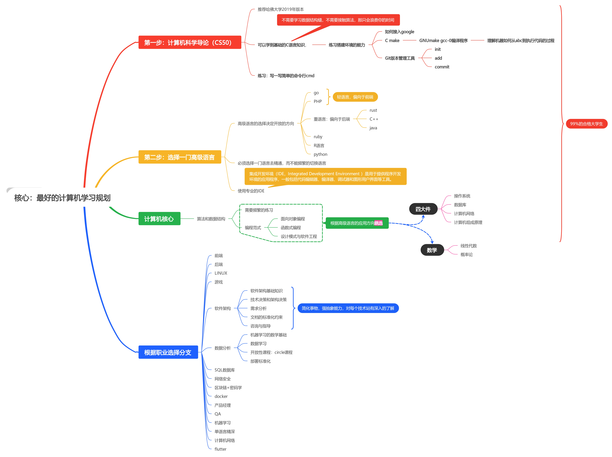

我的规划

[toc]

## 我的计算机规划

> 关于自己的计算机规划。
>
> 参照： [bilibili](https://www.bilibili.com/video/BV1TrHuepERf/?spm_id_from=333.999.0.0)

### 1. 计算机科学导论（CS50）

> 计算机必学的。
>
> 区分科班与非科班。
>
> 推荐`19年哈佛大学cs50` : [bilibili](https://www.bilibili.com/video/BV1cE411j7in?p=1&vd_source=86b829d6caeffc65037786a84ec2cb17) [youtube](https://www.youtube.com/playlist?list=PLhQjrBD2T381L3iZyDTxRwOBuUt6m1FnW)

### 2. C语言

> 在CS50中就会学到C语言。
>
> 理解编程环境搭建。
>
> 写一些简单的练习。

### 3. 实用工具

> 快速的学习一些实用的工具。
>
> 1. Google： 学会搜索
> 2. Cmake:    学会编译，运行代码。
> 3. Git:  学会简单的git使用。

### 4. 选择一门高级语言。

> 语言并没有区别，不要再说什么语言好，什么不好，只是他们侧重的问题不一样。
>
> 轻的： C++,  Rust, Ruby等
>
> 重的： Js, PHP, Go等
>
> 选择一个专业的IDE。

### 5. 算法和数据结构

> 欢迎来到`计算机真正的核心`。
>
> 学习数据结构算法： 多去刷题。

### 6. 编程范式

> 理解编程范式： 是对你选择的高级语言的精通和精深。
>
> 面向对象：OOP
>
> 函数式编程： FP
>
> 设计模式与软件工程： modle

### 7. 四大件

> 选择学习： 根据自己的需求。选择你想学习的四大件之一
>
> 操作系统： OS
>
> 数据库： SQL
>
> 计算机网络: Net
>
> 计算机组成原理： Orgonzation

### 8. 数学

> 选择学习：如果想要做更好的开发。
>
> 线性代数
>
> 概率论

### 9. 选择分支学习

> 恭喜你，你已经是各合格的开发了。
>
> 现在，你要做的就是，学习各个分支的东西。
>
> 最重要的是打开`BOOS`看他招聘的要求学习。

> ==最重要的点：==  保持学习与生活的平衡，专注学习，逐步提升能力。

