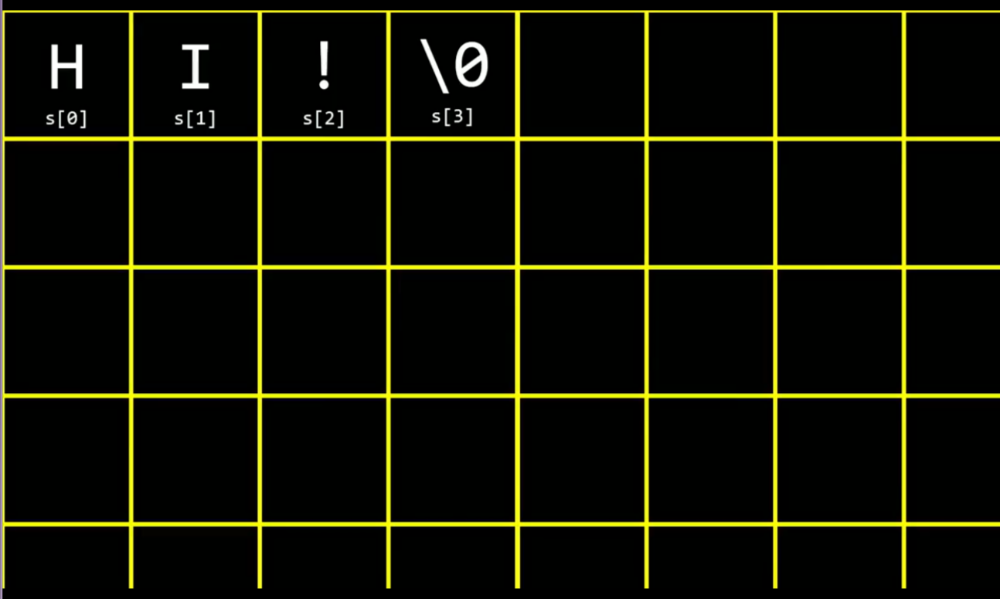
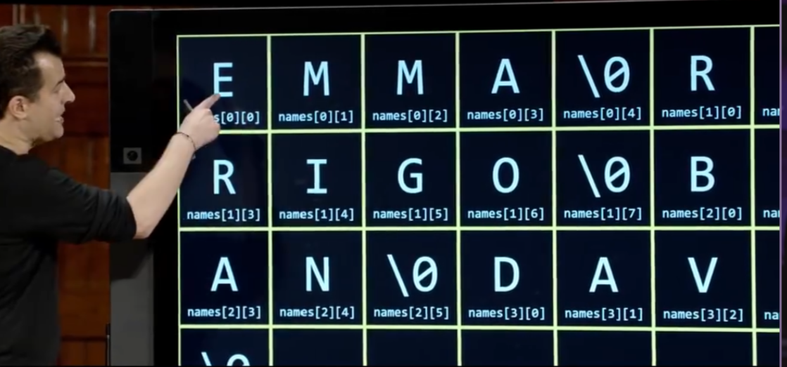

<center>Arrays</center>


[TOC]


## 数组

> 储存多个数据。


1. 练习1： 存储学生多个成绩，计算平均数

```C
#include <stdio.h>
#include "input_helpers.h"


float avaerage(int lenght, int array);

int main(void)
{
  int n = get_int("please input your score number:");

  int scores[n];

  for (int i = 0; i < n; i++) {

    scores[i] = (int) get_int("Score : ");

  }
  printf("Average: %.1f\n",avaerage(n,scores));
}

// 计算平均数 
float avaerage(int lenght, int array[])
{

  int sum = 0;
  for (int i = 0; i < lenght; i++) {
    sum += array[i];
  }
  
  return (float)sum / (float)lenght;
}

```


* 字符串在内存中的位置

```C
string str = "HI!";
```



* 数组在内存中的位置

```C
#include <stdio.h>
#include "cs50.h"

int main(void)
{
  string names[4];
  
  names[0] = "EMMA";
  names[1] = "JACK";
  names[2] = "Blue";
  names[3] = "GOER";

  printf("%s\n",names[0]);

  printf("%c%c%c%c%i\n",names[0][0],names[0][1],names[0][2],names[0][3],names[0][4]);
}

```




* 练习1：

```C
#include <stdio.h>
#include <string.h>
#include "cs50.h"

int main(void)
{
  string s = get_string("Input:");

  printf("Output: ");
  
  // 千万不要这样写，每次循环都会调用strlen函数
  for (int i = 0; i < strlen(s); i++) {
    printf("%c",s[i]);
  }

  // 这样写
  n = strlen(s);
  for (int i = 0; i < n; i++) {
    printf("%c",s[i]);
  }
  printf("\n");
}
```

* 练习2: 接收参数

```C
#include <stdio.h>

int main(int argc, string arav[])
{
  if(argc != 2)
  {
    printf("missing agr\n");
    return 1;
  }

  printf("Hello, %s\n",argv[1]);
  return 0;
}
```

