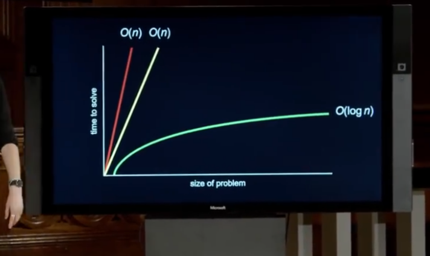
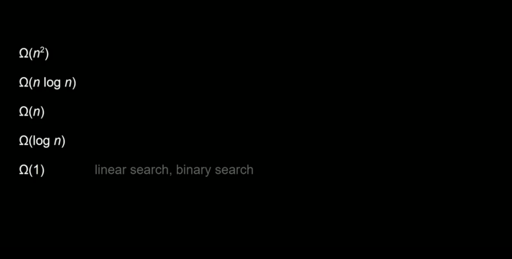
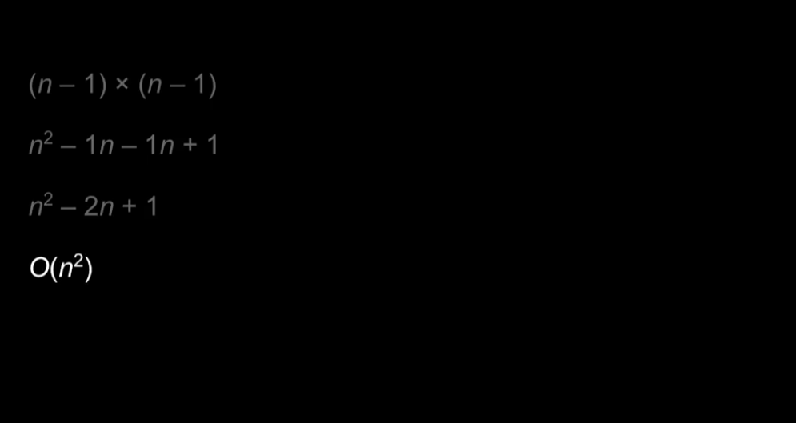
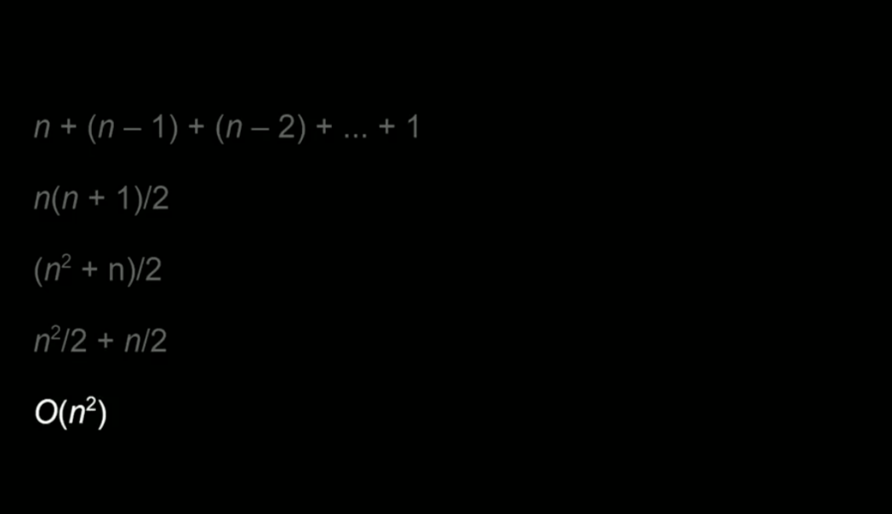
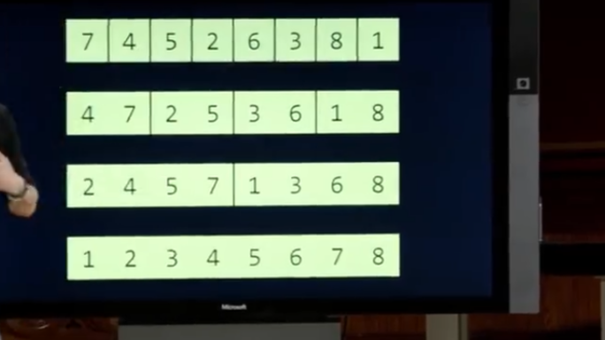
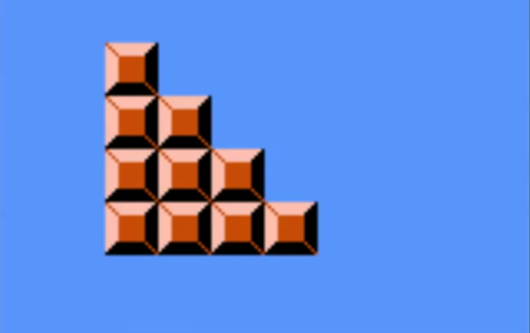
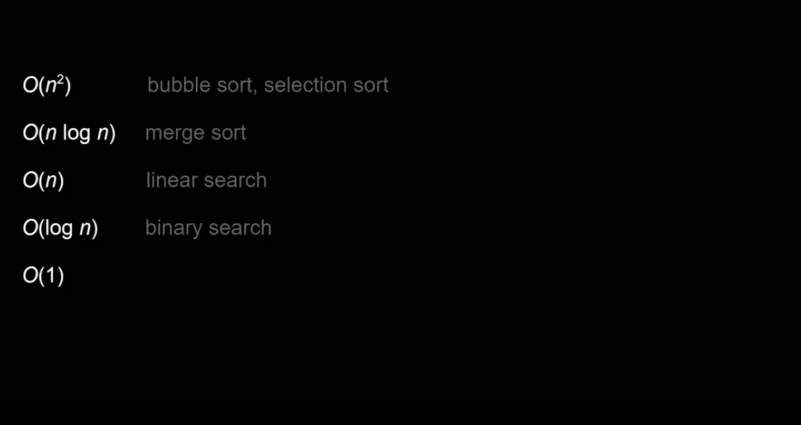
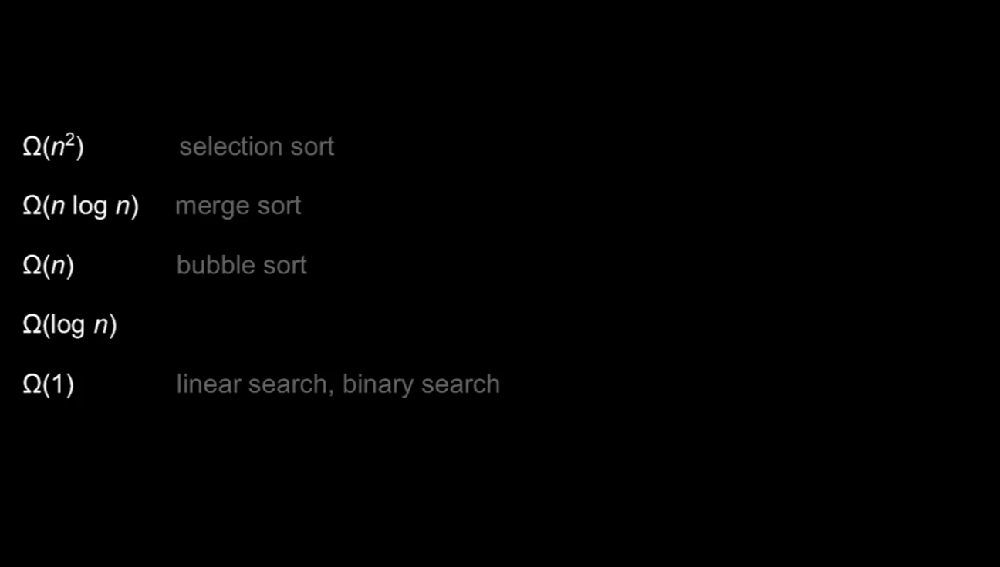

<center>Algorithms</center>


[toc]


## Algorithms

> 算法:。
>
> cs50的源码： [github](https://github.com/braden337/cs50/blob/master/library/cs50.h)

```shell
# 把cs50编译到自己的库。 记得看README.md
gcc -c -ggdb -std=c99 cs50.c -o cs50.o
ar rcs libcs50.a cs50.o
rm cs50.o
chmod 0644 cs50.h libcs50.a
cp cs50.h /usr/local/include
cp libcs50.a /usr/local/lib
```


### 1.常见搜索算法

> 时间复杂度：






1. 线性搜索： Linear search

> 一个一个的找符合的数据。

```C
#include <cs50.h>
#include <stdio.h>

int main(void)
{
  int numbers[6] = {4, 8, 10, 11,40};

  // 线性搜索
  for (int i = 0; i < 5; i++) {
    if(numbers[i] == 40){

      printf("Found\n");
      return 0;
    } 
  }

  printf("Not found\n");
  return 1;
}
```

> `make hello` : 编译了。

```C
// 字符串 查找
#include <cs50.h>
#include <stdio.h>
#include <string.h>

int main(void)
{
  string names[3] = {"EMMA","JACK","GOER"};

  for (int i = 0; i < 3; i++) {
    // strcmp 比较字符串的函数
    if (strcmp(names[i], "EMMA") == 0) {
      printf("Found\n");
      return 0;
    }
  }

  printf("Not found\n");
  return 1;
}
```

> 如果我们想将一个人的姓名和电话对应起来，应该怎么做？

```C
// 自定义类型
#include <cs50.h>
#include <stdio.h>
#include <string.h>

/* 自定义类型 */
typedef struct
{
  string name;
  string number;
}
person;

int main(void)
{
  person people[3];

  people[0].name = "EMMA";
  people[0].number = "321-2131323";

  people[1].name = "JACK";
  people[1].number = "321-3243243";
  
  people[2].name = "GOER";
  people[2].number = "123-3243243";

  for (int i = 0; i > 3; i++) {

    if(strcmp(people[i].name, "EMMA") == 0)
    {
      printf("%s\n",people[i].number);
      return 0;
    }
  }

  printf("Not found\n");
  return 1;
}

```


2. 二分查找： binary search

> 每次找这组数据的一半。

```C
#include <stdio.h>


int binary_search(int arr[], int len, int target){
  int low = 0;
  int high = len -1;

  while(low <= high){
    int mid = low + (high - low) / 2; // 防止溢出

    if(arr[mid] == target){
      return mid;
    }else if (arr[mid] < target) {
      low = mid + 1; // 目标在右边
    }else{
      high = mid -1; // 目标在左边
    }
  }

  return -1;
}

int main(void){
  int number[] = { 2, 5, 7, 9,10, 20};
  int target = 10;
  int len_num = sizeof(number) / sizeof(number[0]); // 正确的数组长度
  int index = binary_search(number,len_num, target);

  if (index != -1) {
    printf("目标值 %d 位于索引 %d\n",target, index);
  }else{
    printf("未找到\n");
  }
  return 0;
}
```


3. 冒泡排序:  bubble  sort

> 快速的排序数字大小。

```C
```

时间复杂度：




4. 选择排序： selection sort

> 找到最小或者最大的值，直接和最开始的位置的数字交换位置
>
> 比较算法排序的网站： [cs](https://www.cs.usfca.edu/~galles/visualization/ComparisonSort.html)

```C
```

时间复杂度：




5. 合并排序：marge sort

> 将数组分为左右数组，排序在合并数组




### 2. 练习

> 一些练习

* 马里奥的墙



```C
// 
#include <stdio.h>
#include <cs50.h>

void draw(int h);

int main(void)
{
  
  int height = get_int("Height:");

  draw(height);
}


void draw(int h)
{
  for (int i = 0;i <= h; i++) {
    for (int j = 0; j <= i; j++) {
      printf("#");
    }
  }
  printf("\n");
}
```

> 优化

```C
#include <stdio.h>
#include <cs50.h>

void draw(int h);

int main(void)
{
  
  int height = get_int("Height:");

  draw(height);
}


void draw(int h)
{
  if (h == 0) {
    return ;
  }
    // 递归，只用了一次循环。
  draw(h -1);

  for (int i = 0; i < h ; i++) {
    printf("#");
  }
  printf("\n");
}
```


> 几种算法的时间复杂度和欧米伽





