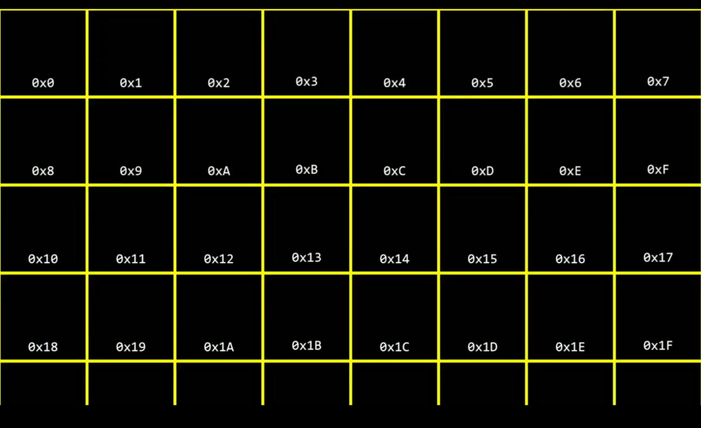
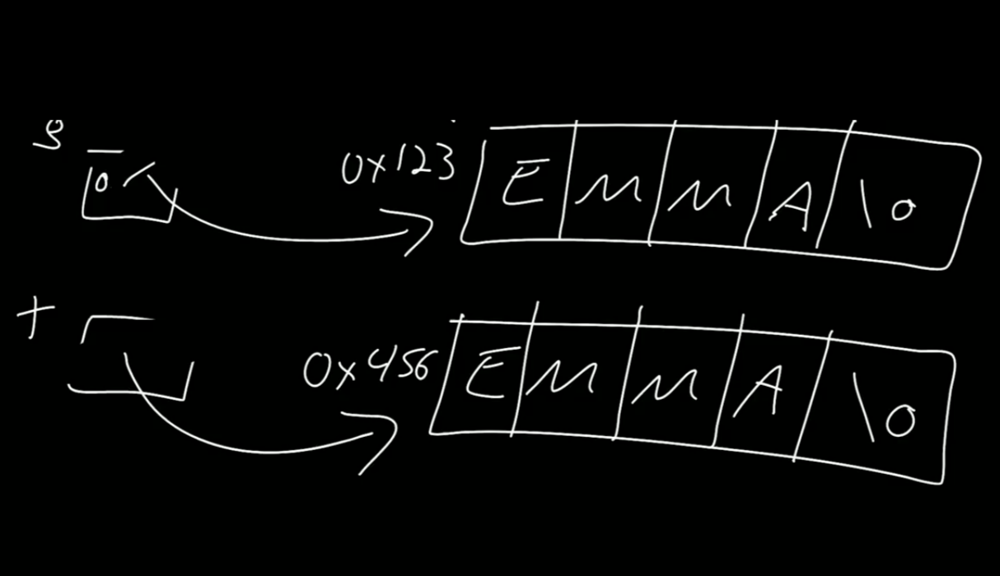

<center>Mamory</center>


[toc]


## Mamory

> 内存：数据在内存中的样子。


### 1. 十六进制

> 十六进制：存储数据。
>
> RGB: `#FF0000` 红色。 




```C
// 地址 &  
// 指针 *
#include <stdio.h>

int main(void)
{
  int n = 10;
	
    // 打印地址： 0x7ffc77f9ab34
   printf("%p\n",&n);
   
    // 指针获取该地址的值。
   printf("%i\n",*&n); 

}
```


```C
#include <stdio.h>

int main(void)
{
  int n = 10;

  int *p = &n;

  printf("%i\n",*p);
}
```

> 字符串

```C
#include <stdio.h>

int main(void)
{

  char *s = "GOER";

  printf("%p\n",s);
  printf("%p\n",&s[0]);
  printf("%p\n",&s[1]);
  printf("%p\n",&s[2]);
  printf("%p\n",&s[3]);
}

0x64aa2a10d004
0x64aa2a10d004
0x64aa2a10d005
0x64aa2a10d006
0x64aa2a10d007
```

```C
#include <stdio.h>

int main(void)
{

  char *s = "GOER";

  // G
  printf("%c\n",*s);

  printf("%c\n",*(s+1));
  printf("%c\n",*(s+2));
  printf("%c\n",*(s+3));
  // 空格
  printf("%c\n",*(s+4));
}
```

> 字符串对比：

```C
#include <stdio.h>
#include <cs50.h>


int main(void)
{
  string s = get_string("S:");
  string t = get_string("T:");

  if (s == t) {
    printf("Same\n");
    
  }
  else { 
   printf("Not same\n"); 
  }  
}
// 输入同样的字符串 也是不相同的。
```



```C

int main(void)
{

  char *s = get_string("s: ");
  // 内存分配
  char *t = malloc(strlen(s) + 1);
  
  // 复制
  strcpy(t,s);

  // 低一个字符大写
  t[0] = toupper(t[0]);

  printf("%s\n",s);
  printf("%s\n",t);
}
```


