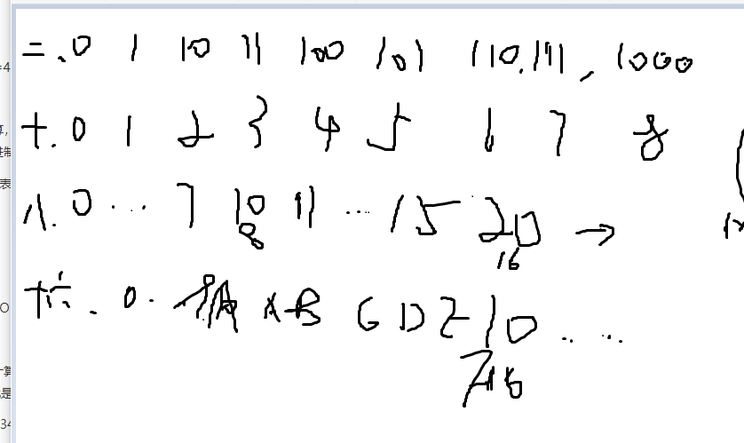

<center>数据类型</center>

[toc]


## 数据类型

> Go语言中有丰富的数据类型，除了基本的整型、浮点型、布尔型、字符串外，还有数组、切片、结构体、函数、map、通道（channel）等。Go 语言的基本类型和其他语言大同小异。


>  基本数据类型

### 1. 整形

> 整型分为以下两个大类： 按长度分为：int8、int16、int32、int64 
>
> 对应的无符号整型：uint8、uint16、uint32、uint64

|  类型  |                             描述                             | 字节 |
| :----: | :----------------------------------------------------------: | ---- |
| uint8  |                  无符号 8位整型 (0 到 255)                   | 1    |
| uint16 |                 无符号 16位整型 (0 到 65535)                 | 2    |
| uint32 |              无符号 32位整型 (0 到 4294967295)               | 4    |
| uint64 |         无符号 64位整型 (0 到 18446744073709551615)          | 8    |
|  int8  |                 有符号 8位整型 (-128 到 127)                 | 1    |
| int16  |              有符号 16位整型 (-32768 到 32767)               | 2    |
| int32  |         有符号 32位整型 (-2147483648 到 2147483647)          | 4    |
| int64  | 有符号 64位整型 (-9223372036854775808 到 9223372036854775807) | 8    |

> 特殊整形   

|  类型   |                          描述                          |
| :-----: | :----------------------------------------------------: |
|  uint   | 32位操作系统上就是`uint32`，64位操作系统上就是`uint64` |
|   int   |  32位操作系统上就是`int32`，64位操作系统上就是`int64`  |
| uintptr |              无符号整型，用于存放一个指针              |

**注意：** 在使用`int`和 `uint`类型时，不能假定它是32位或64位的整型，而是考虑`int`和`uint`可能在不同平台上的差异。

> **注意事项** 获取对象的长度的内建`len()`函数返回的长度可以根据不同平台的字节长度进行变化。
>
> 为了保持文件的结构不会受到不同编译目标平台字节长度的影响，不要使用`int`和 `uint`。

> 拓展：
>
> 进制转换

```go
文件大小转换： https://www.bejson.com/convert/filesize/
1字节(byte) = 8Bits
```

> 二进制  十进制  八进制 十六进制
>
> 转换为 **十进制** 在转为其他进制




> 数字字面量语法
>
> `v := 0b00101101`， 代表二进制的 101101   ==0b==
>
> `v := 0o377`，代表八进制的 377					==0o==
>
> `v := 0x1p-2`，代表十六进制的 1 除以 2²     ==0x==

```go
// 借助fmt函数来将一个整数以不同进制形式展示。  printf格式化

// 十进制
var a int = 10
fmt.Printf("%d \n", a)  // 10     %d 表示整形
fmt.Printf("%b \n", a)  // 1010  占位符%b表示二进制

// 八进制  以0开头
var b int = 077
fmt.Printf("%o \n", b)  // 77     %o 八进制

// 十六进制  以0x开头         
var c int = 0xff
fmt.Printf("%x \n", c)  // ff    %x 十六进制
fmt.Printf("%X \n", c)  // FF
```


### 2. 浮点数

> Go语言支持两种浮点型数：`float32`和`float64`。

| **类型** | **类型** | **默认值** |
| -------- | -------- | ---------- |
| float32  | 4        | 0.0        |
| float64  | 8        | 0.0        |

```go
// 打印浮点数时，可以使用fmt包配合动词%f
var f01 float32 = 0.32343

fmt.Printf("%f\n", f01)

fmt.Printf("%.2f\n", f01) // .2保留两位小数
```


### 3. 复数

> complex64 `8字节`和complex128 `16字节`
>
> 复数有实部和虚部，complex64的实部和虚部为32位，complex128的实部和虚部为64位。

```go
// 复数
var c1 complex64

c1 = 1 + 2i

fmt.Println(c1)
```


### 4. 布尔值

> Go语言中以`bool`类型进行声明布尔型数据，布尔型数据只有`true（真）`和`false（假）`两个值。

**注意：** (go与其他的区别)

1. 布尔类型变量的默认值为`false`。
2. Go 语言中不允许将整型强制转换为布尔型.
3. 布尔型无法参与数值运算，也无法与其他类型进行转换。


### 5. 字符串

>  Go 语言里的字符串的内部实现使用`UTF-8`编码。 字符串的值为`双引号(")`中的内容

```go
s1 := "hello"
s2 := "世界"

// 多行字符 反引号字符
s1 := `第一行
第二行
第三行
`
fmt.Println(s1)
```


> Go 语言的字符串常见转义符包含回车、换行、单双引号、制表符等

| 转义符 |                含义                |
| :----: | :--------------------------------: |
|  `\r`  |         回车符（返回行首）         |
|  `\n`  | 换行符（直接跳到下一行的同列位置） |
|  `\t`  |               制表符               |
|  `\'`  |               单引号               |
|  `\"`  |               双引号               |
|  `\\`  |               反斜杠               |

> 打印windows一个文件路径

```go
var winStr string = "C:\\Windows\\debug\\WIA"
fmt.Printf("路径为：%v\n",winStr)  // %v打印 值的默认格式表示
```

> 拓展：查看数据类型

```go
// fmt  %T 查看数据类型
// %T	打印值的类型
fmt.Printf("类型为:%T\n", s2)
```


> 字符串常用操作

1. 求字符串长度

```go
// 一个汉字 占3~4个字节   len("北") == 3
// golang的编码统一为utf-8
// ascii的字符（字母和数字）占一个字节，汉字占3个字节

str := len("go人")  // 5
```

2. 拼接

```go
// php是 . 拼接   go 和好多语言都是  + 拼接
str2 := "i' am"+"goer"
```

3. 分割成数组

```go
var str1 string = "A-B-C-d"
// 字符串  分割字符
strArr := strings.Split(str1, "-")

fmt.Println(strArr)
// 打印出一个数组
```

4. 合成数组

```go
// 数组  拼接字符
strnew := strings.Join(strArr, "&")

fmt.Println(strnew)
```


#### byte和rune类型

> 组成每个字符串的元素叫做“字符”

```go
var a = "b"  // byte
var b = "中"  //rune
```

>1. byte型   `uint8`类型   代表了`ASCII码`的一个字符。
>2. rune型  类型实际是一个`int32`。 代表一个 `UTF-8字符`。

> 当需要处理中文、日文或者其他复合字符时，则需要用到`rune`类型 
>
> 使用byte型  性能和扩展性都有照顾

```go
// 遍历字符串
str := "i'am 浩. from 中国"

for i := 0; i < len(str); i++ { // byte
    fmt.Printf("%v(%c)", str[i], str[i]) // %v默认值  %c  该值对应的unicode码值
}

fmt.Println("--------")

for _, r := range str { // rune类
    fmt.Printf("%v(%c)", r, r)
}
```

```go
// byte类型打印中文是有问题的
105(i)39(')97(a)109(m)32( )230(æ)181(µ)169(©)46(.)32( )102(f)114(r)111(o)109(m)32( )228(ä)184(¸)173(­)229(å)155(

105(i)39(')97(a)109(m)32( )28009(浩)46(.)32( )102(f)114(r)111(o)109(m)32( )20013(中)22269(国)
```

> 修改字符串
>
> > 要修改字符串，需要先将其转换成`[]rune`或`[]byte`，完成后再转换为`string`。无论哪种转换，都会重新分配内存，并复制字节数组。

```go
str := "abc"

// 强制类型转换

bytStr := []byte(str) // []byte型
//fmt.Println(bytStr) //[97 98 99]
bytStr[1] = 'B'
fmt.Println(string(bytStr)) //强制类型转换

str2 := "北京天京"

runStr := []rune(str2) //[]rune型
// fmt.Println(runStr) // [21271 20140 22825 27941]

runStr[3] = '津'

fmt.Println(string(runStr)) // 强制转换为string
```


#### 6. 类型转换

> go只有强制类型转换

```go
T(表达式)
var a uint8 = 235
str := string(a)  // 转换为string
```


# 练习题

1. 编写代码分别定义一个整型、浮点型、布尔型、字符串型变量，使用`fmt.Printf()`搭配`%T`分别打印出上述变量的值和类型。

```go
var (
	num uint8 = 255
	flo       = 0.43543
	bol       = false
	str       = "golang"
)
func main() {
	fmt.Printf("值:%v,类型:%T\n", num, num)
	fmt.Printf("值:%v,类型:%T\n", flo, flo)
	fmt.Printf("值:%v,类型:%T\n", bol, bol)
	fmt.Printf("值:%v,类型:%T\n", str, str)

}
```


2. 编写代码统计出字符串`"hello go先生 你好"`中汉字的数量。

```go
```

