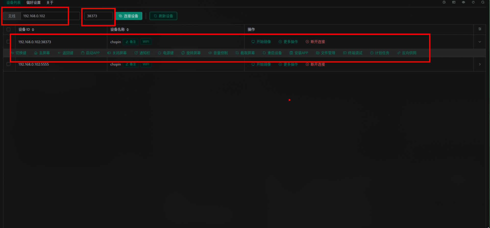

<center>scrcpy连接手机</center>


[toc]


## scrcpy连接手机

> scrcpy连接手机。[github](https://github.com/Genymobile/scrcpy)


### 1. 安装

```shell
# 安卓工具 # adb fastboot
sudo pacman -S android-tools android-udev

# scrcpy
yay -S scrcpy

# 可视化软件
yay -S aur/escrcpy-bin
```


### 2. 步骤

#### 1.  手机设置

1. **开启开发者选项**

- 设置 → 关于手机 → MIUI版本（点击7次）
- 返回设置 → 更多设置 → 开发者选项

2. **开启USB调试**

- 开发者选项 → USB调试（打开）
-  开发者选项 → USB调试（安全设置）（打开）
-   开发者选项 → 允许ADB调试（打开）
-  无线调试 (打开)


#### 2. 电脑配置

```shell
# 1. 确保手机和电脑在同一网络
# 2. 先用USB连接手机
adb tcpip 5555

# 3. 获取手机IP地址（在手机设置中查看）
# 4. 连接到手机
adb connect 手机IP:5555

# 5. 断开USB，启动scrcpy
scrcpy --tcpip=手机IP:5555
```

> 常用参数

```shell
# 设置最大尺寸（降低分辨率提高性能）
scrcpy --max-size 800

# 限制帧率
scrcpy --max-fps 30

# 设置视频码率
scrcpy --bit-rate 2M

# 关闭手机屏幕
scrcpy --turn-screen-off

# 显示触摸点
scrcpy --show-touches

# 全屏显示
scrcpy --fullscreen
```

> `escrcpy-bin`远程连接。

