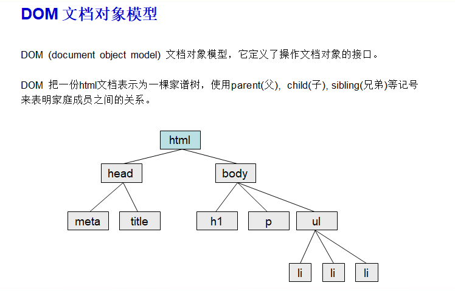

<center>文档对象模型</center>

[toc]

## 文档对象模型

> `DOM(document object model) ` 文档对象模型
>
> 操作文档对象接口

#### 1. DOM家谱树



#### 2. 节点

>  html元素

`<a href=":///baidu.com">百度一下</a>`

> 1. 元素节点        标签名  `a`
> 2. 文本节点         元素内 容 `百度一下`
> 3. 属性节点         元素属性` href=":///baidu.com"`


#### 3. 获取节点


##### (1) id  获取

> 先 节点设置id 属性

```js
<p id="one">aaaabbbbcccc</p>

var eee = document.getElementById('one');

// js操作元素，设置属性是内联样式
eee.style.fontSize = '20px';    // 不能写font-size这种
eee.style.backgroundColor = 'skyblue';

// 对节点内容进行增删改查
// 查询
eee.innerHTML;

// 增
eee.innerHTML = 'aaa'+eee.innerHTML+'bbb';

//删
eee.innerHTML = '';

//改
eee.innerHTML = '666';  // 666
```

> 在新更新的js中 ==获取id节点可以不写==

```html
<div id="box">aaa</div>


<script type="text/javascript">
//不用获取节点
consloe.log(box.innerHTML)
consloe.log(box.innerHTML = 'aaa')
</script>

```


##### (2)标签名 获取

> 获取到是数组结构

```js
<p>aaa<p>
<p>bbb<p>

var p = document.getElementsByTagName('p') 
// 获取到多个
```


##### (3) class名 获取

> 数组，多个

```js
<p class="aa">aaa<p>
<p class="aa">bbb<p>

var p = document.getElementByClassName('aa')
// 可以是多个
```


##### (4) name 值 获取

> 数组，多个

```js
<input name="user"/>

var user = document.getElementsByName('user');
```


##### (5) 选择符 选中一个

> 数组，多个    `和css选择符一样用法`

```js
<p class="aa">aaa
<p>
<p class="aa">bbb<p>

var p = document.querySelector('p'); // 只选中第一个
var p = document.querySelector('.aa'); 
```


##### (6) 选择符  多个

> 数组，多个    `和css选择符一样用法`

```js
<p class="aa">aaa<p>
<p class="aa">bbb<p>

var p2 = document.querySelectorAll('p') // 选中多个
var p2 = document.querySelectorAll('.aa') // 选中多个
```

> `querSelectorAll和querSelector`就是用css选择符


#### 3.代码优化

> 类似*隔行换色*这种，我们可以优化代码  **有规律的**

```js
// 隔行换色z
<ul id="ul">	
    <li>111</li>
    <li>222</li>
    <li>333</li>
    
</ul>

// 一般我们是这样做
var lilist = document.getElementByid('ul').getElementsByTagName('li')
for(var i=0; i<lilist.length; i++){
    if(i%2==0){
        li[i].style.backgroundColor="blue";
    }else{
        li[i].style.backgroundColor="yellow";
    }
}

// 这样更优化
var a1 = true;
for(var i=0; i<lilist.length; i++){
    if(a1){
        li[i].style.backgroundColor="blue";
        a1=false;
    }else{
        li[i].style.backgroundColor="yellow";
    	a1=true;
    }
    
}
```

