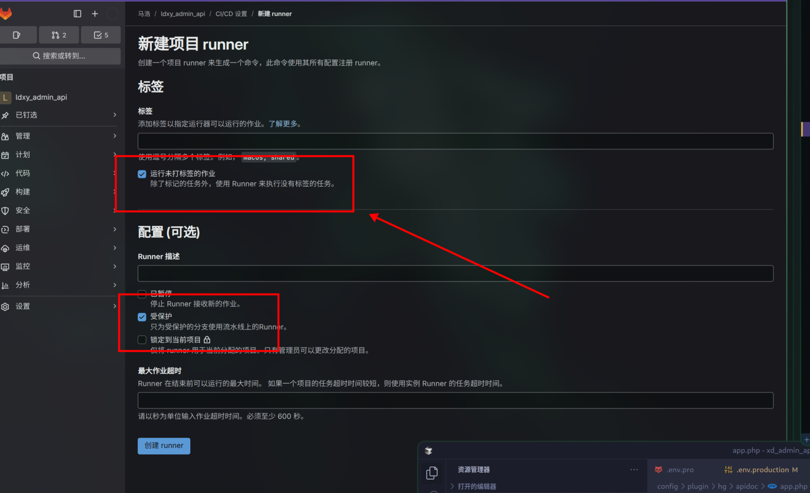

<center>Gitlab Runner部署</center>


[toc]


## Gitlab Runner部署

> 自动化部署服务。


### 1. 安装gitlab

> 直接使用docker安装gitlab

1. 管理员进入gitlab菜单。

2. 新建runner实例


```shell
# Download the binary for your system
sudo curl -L --output /usr/local/bin/gitlab-runner https://gitlab-runner-downloads.s3.amazonaws.com/latest/binaries/gitlab-runner-linux-amd64

# Give it permission to execute
sudo chmod +x /usr/local/bin/gitlab-runner

# Create a GitLab Runner user
sudo useradd --comment 'GitLab Runner' --create-home gitlab-runner --shell /bin/bash

# Install and run as a service
sudo gitlab-runner install --user=gitlab-runner --working-directory=/home/gitlab-runner
sudo gitlab-runner start
```

> 3. 注册
>
> Runner 身份验证令牌 `glrt-t1_s5nxN5b1E1UuxXZCwK6q` 在此处仅短暂显示
>
> > 本机执行选择`shell`

```shell
gitlab-runner register  --url http://gitlab.dianchiguanjia.com  --token glrt-t1_s5nxN5b1E1UuxXZCwK6q
```

4. 手动验证

```shell
gitlab-runner run
```

> 或者命令行重新注册

```shell
sudo gitlab-runner stop
sudo gitlab-runner unregister --all-runners

# 命令 修改为自己的参数
sudo gitlab-runner register \
  --non-interactive \
  --url "http://gitlab.dianchiguanjia.com/" \
  --registration-token "glrt-t1_Kz5pBcn3CVMsUp1doXgP" \
  --description "my-api-cicd" \
  --tag-list "docker" \
  --executor "docker" \
  --docker-image "alpine:latest" \
  --docker-privileged
  
```

> 提示ci没配置的话就是没有`运行打标签作业`




### 2. 配置

> 配置构建发布

1. 创建流水线


```shell
# This file is a template, and might need editing before it works on your project.
# This is a sample GitLab CI/CD configuration file that should run without any modifications.
# It demonstrates a basic 3 stage CI/CD pipeline. Instead of real tests or scripts,
# it uses echo commands to simulate the pipeline execution.
#
# A pipeline is composed of independent jobs that run scripts, grouped into stages.
# Stages run in sequential order, but jobs within stages run in parallel.
#
# For more information, see: https://docs.gitlab.com/ee/ci/yaml/#stages
#
# You can copy and paste this template into a new `.gitlab-ci.yml` file.
# You should not add this template to an existing `.gitlab-ci.yml` file by using the `include:` keyword.
#
# To contribute improvements to CI/CD templates, please follow the Development guide at:
# https://docs.gitlab.com/ee/development/cicd/templates.html
# This specific template is located at:
# https://gitlab.com/gitlab-org/gitlab/-/blob/master/lib/gitlab/ci/templates/Getting-Started.gitlab-ci.yml

stages:          # List of stages for jobs, and their order of execution
  - build
  - test
  - deploy

build-job:       # This job runs in the build stage, which runs first.
  stage: build
  script:
    - echo "Compiling the code..."
    - echo "Compile complete."

unit-test-job:   # This job runs in the test stage.
  stage: test    # It only starts when the job in the build stage completes successfully.
  script:
    - echo "Running unit tests..."
    - echo "Code coverage is 90%"

lint-test-job:   # This job also runs in the test stage.
  stage: test    # It can run at the same time as unit-test-job (in parallel).
  script:
    - echo "Linting code..."
    - echo "No lint issues found."

deploy-job:      # This job runs in the deploy stage.
  stage: deploy  # It only runs when *both* jobs in the test stage complete successfully.
  environment: production
  script:
    # 开始部署提示
    - echo "开始部署应用..."
    
    # 配置 Alpine 镜像源为国内阿里云源，提高下载速度
    - echo "正在切换到阿里云镜像源..."
    - sed -i 's/dl-cdn.alpinelinux.org/mirrors.aliyun.com/g' /etc/apk/repositories
    - apk update
    - echo "镜像源切换完成"
    
    # 安装必要的 SSH 工具
    - echo "正在安装 sshpass..."
    - apk add --no-cache sshpass
    - echo "sshpass 安装完成"
    
    - echo "正在安装 SSH..."
    - apk add --no-cache openssh-client
    - echo "SSH 安装完成"
    
    # 远程服务器连接和代码部署
    - echo "正在连接远程服务器..."
    - sshpass -p "pass" ssh -o StrictHostKeyChecking=no root@ip
    - echo "远程服务器连接成功"
    
    # 更新代码并重启服务
    - echo "正在拉取最新代码..."
    - cd /www/wwwroot/adminapi.dianchiguanjia.com
    - git pull origin main
    - echo "代码更新完成"
    
    # 重启 Webman 服务
    - echo "正在重启 Webman 服务..."
    - php webman restart -d
    - echo "Webman 服务已重启"
    
    # 部署完成提示
    - echo "应用部署完成！"


```

