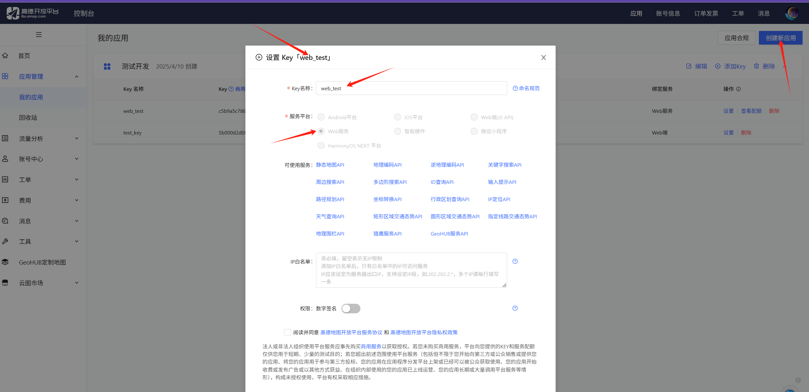

<center>api</center>

[toc]

## api

> api接口指的是应用程序编程接口（Application Programming Interface）。

提供api服务 [apishop](https://www.apishop.net/)


### 1. 高德地图

> 对接高德地图api
>
> [高德](https://lbs.amap.com/)
>
> 首先注册实名。



```php
<?php

namespace app\service\sale;

class MapService
{


    private static $amapApiKey = 'YOUR_AMAP_API_KEY'; // 替换为你的高德地图API密钥


    /**
     * 通过腾讯地图 API 获取省市区信息
     * @param float $latitude 纬度
     * @param float $longitude 经度
     * @param string $apiKey 腾讯地图 API 密钥
     * @return array 返回包含省、市、区的信息
     */
    public static function getProvinceCityDistrict($latitude, $longitude) {
        // 构造 API 请求 URL
        $url = "https://restapi.amap.com/v3/geocode/regeo?location={$longitude},{$latitude}&key=" . self::$amapApiKey;

        // 初始化 cURL
        $ch = curl_init();
        curl_setopt($ch, CURLOPT_URL, $url);
        curl_setopt($ch, CURLOPT_RETURNTRANSFER, true);
        curl_setopt($ch, CURLOPT_CONNECTTIMEOUT, 10); // 连接超时时间
        curl_setopt($ch, CURLOPT_TIMEOUT, 30); // 请求超时时间
        curl_setopt($ch, CURLOPT_SSL_VERIFYPEER, false); // 关闭 SSL 验证
        curl_setopt($ch, CURLOPT_SSL_VERIFYHOST, false); // 关闭 SSL 验证


        // 执行请求并获取响应
        $response = curl_exec($ch);
        $httpCode = curl_getinfo($ch, CURLINFO_HTTP_CODE);
        $error = curl_error($ch);
        curl_close($ch);

        // 检查 cURL 错误
        if ($error) {
            return [
                'status' => 'error',
                'message' => "cURL 错误：{$error}"
            ];
        }

        // 检查 HTTP 状态码
        if ($httpCode != 200) {
            return [
                'status' => 'error',
                'message' => "HTTP 请求失败，状态码：{$httpCode}"
            ];
        }

        // 解析 JSON 响应
        $data = json_decode($response, true);

        // 检查 API 返回的状态
        if ($data['status'] != 0) {
            return [
                'status' => 'error',
                'message' => "API 调用失败：{$data['message']}"
            ];
        }

        // 提取省、市、区信息
        $result = $data['regeocode']['addressComponent'];
        return [
            'status' => 'success',
            'result' => [
                'province' => $result['province'],
                'city' => $result['city'],
                'district' => $result['district'],
                'address' => $data['regeocode']['formatted_address']
            ]
        ];
    }


    /**
     * 通过腾讯地图 API 获取IP地址对应的详细地址
     * @param string $ip IP地址
     * @param string $apiKey 腾讯地图 API 密钥
     * @return array 返回包含省、市、区的信息
     */
    public static function getAddressByIP($ip) {
        // 构造 API 请求 URL
        $url = "https://restapi.amap.com/v3/ip?ip={$ip}&key=" . self::$amapApiKey;

        // 初始化 cURL
        $ch = curl_init();
        curl_setopt($ch, CURLOPT_URL, $url);
        curl_setopt($ch, CURLOPT_RETURNTRANSFER, true);
        curl_setopt($ch, CURLOPT_CONNECTTIMEOUT, 10); // 连接超时时间
        curl_setopt($ch, CURLOPT_TIMEOUT, 30); // 请求超时时间
        curl_setopt($ch, CURLOPT_SSL_VERIFYPEER, false); // 关闭 SSL 验证
        curl_setopt($ch, CURLOPT_SSL_VERIFYHOST, false); // 关闭 SSL 验证

        // 执行请求并获取响应
        $response = curl_exec($ch);
        $httpCode = curl_getinfo($ch, CURLINFO_HTTP_CODE);
        $error = curl_error($ch);
        curl_close($ch);

        // 检查 cURL 错误
        if ($error) {
            return [
                'status' => 'error',
                'message' => "cURL 错误：{$error}"
            ];
        }

        // 检查 HTTP 状态码
        if ($httpCode != 200) {
            return [
                'status' => 'error',
                'message' => "HTTP 请求失败，状态码：{$httpCode}"
            ];
        }

        // 解析 JSON 响应
        $data = json_decode($response, true);

        // 检查 API 返回的状态
        if ($data['status'] != 0) {
            return [
                'status' => 'error',
                'message' => "API 调用失败：{$data['message']}"
            ];
        }

        // 提取省、市、区信息
        $result = $data['province'] . $data['city'] . $data['district'];
        return [
            'status' => 'success',
            'result' => [
                'province' => $data['province'],
                'city' => $data['city'],
                'district' => $data['district'],
                'address' => $result
            ]
        ];
    }

}
```


### 腾讯地图

> 对接腾讯地图api
>
> [腾讯地图](https://lbs.qq.com/)
>
> 注册，认证。

```php
<?php

namespace app\service\sale;

class MapService
{

    /**
     * 通过腾讯地图 API 获取省市区信息
     * @param float $latitude 纬度
     * @param float $longitude 经度
     * @param string $apiKey 腾讯地图 API 密钥
     * @return array 返回包含省、市、区的信息
     */
    public static function getProvinceCityDistrict($latitude, $longitude, $apiKey) {
        // 构造 API 请求 URL
        $url = "https://apis.map.qq.com/ws/geocoder/v1/?location={$latitude},{$longitude}&key={$apiKey}";

        // 初始化 cURL
        $ch = curl_init();
        curl_setopt($ch, CURLOPT_URL, $url);
        curl_setopt($ch, CURLOPT_RETURNTRANSFER, true);
        curl_setopt($ch, CURLOPT_CONNECTTIMEOUT, 10); // 连接超时时间
        curl_setopt($ch, CURLOPT_TIMEOUT, 30); // 请求超时时间
        curl_setopt($ch, CURLOPT_SSL_VERIFYPEER, false); // 关闭 SSL 验证
        curl_setopt($ch, CURLOPT_SSL_VERIFYHOST, false); // 关闭 SSL 验证


        // 执行请求并获取响应
        $response = curl_exec($ch);
        $httpCode = curl_getinfo($ch, CURLINFO_HTTP_CODE);
        $error = curl_error($ch);
        curl_close($ch);

        // 检查 cURL 错误
        if ($error) {
            return [
                'status' => 'error',
                'message' => "cURL 错误：{$error}"
            ];
        }

        // 检查 HTTP 状态码
        if ($httpCode != 200) {
            return [
                'status' => 'error',
                'message' => "HTTP 请求失败，状态码：{$httpCode}"
            ];
        }

        // 解析 JSON 响应
        $data = json_decode($response, true);

        // 检查 API 返回的状态
        if ($data['status'] != 0) {
            return [
                'status' => 'error',
                'message' => "API 调用失败：{$data['message']}"
            ];
        }

        // 提取省、市、区信息
        $result = $data['result'];
        return [
            'result' => [
                'province' => $result['ad_info']['province'],
                'city' => $result['ad_info']['city'],
                'district' => $result['ad_info']['district'],
                'address' => $result['address']
            ]
        ];
    }


    /**
     * 通过腾讯地图 API 获取IP地址对应的详细地址
     * @param string $ip IP地址
     * @param string $apiKey 腾讯地图 API 密钥
     * @return array 返回包含省、市、区的信息
     */
    public static function getAddressByIP($ip, $apiKey) {
        // 构造 API 请求 URL
        $url = "https://apis.map.qq.com/ws/location/v1/ip?key={$apiKey}&ip={$ip}";

        // 初始化 cURL
        $ch = curl_init();
        curl_setopt($ch, CURLOPT_URL, $url);
        curl_setopt($ch, CURLOPT_RETURNTRANSFER, true);
        curl_setopt($ch, CURLOPT_CONNECTTIMEOUT, 10); // 连接超时时间
        curl_setopt($ch, CURLOPT_TIMEOUT, 30); // 请求超时时间
        curl_setopt($ch, CURLOPT_SSL_VERIFYPEER, false); // 关闭 SSL 验证
        curl_setopt($ch, CURLOPT_SSL_VERIFYHOST, false); // 关闭 SSL 验证

        // 执行请求并获取响应
        $response = curl_exec($ch);
        $httpCode = curl_getinfo($ch, CURLINFO_HTTP_CODE);
        $error = curl_error($ch);
        curl_close($ch);

        // 检查 cURL 错误
        if ($error) {
            return [
                'status' => 'error',
                'message' => "cURL 错误：{$error}"
            ];
        }

        // 检查 HTTP 状态码
        if ($httpCode != 200) {
            return [
                'status' => 'error',
                'message' => "HTTP 请求失败，状态码：{$httpCode}"
            ];
        }

        // 解析 JSON 响应
        $data = json_decode($response, true);

        // 检查 API 返回的状态
        if ($data['status'] != 0) {
            return [
                'status' => 'error',
                'message' => "API 调用失败：{$data['message']}"
            ];
        }

        // 提取省、市、区信息
        $result = $data['result'];
        return [
            'status' => 'success',
            'result' => [
                'province' => $result['ad_info']['province'],
                'city' => $result['ad_info']['city'],
                'district' => $result['ad_info']['district'],
            ]
        ];
    }

}
```

