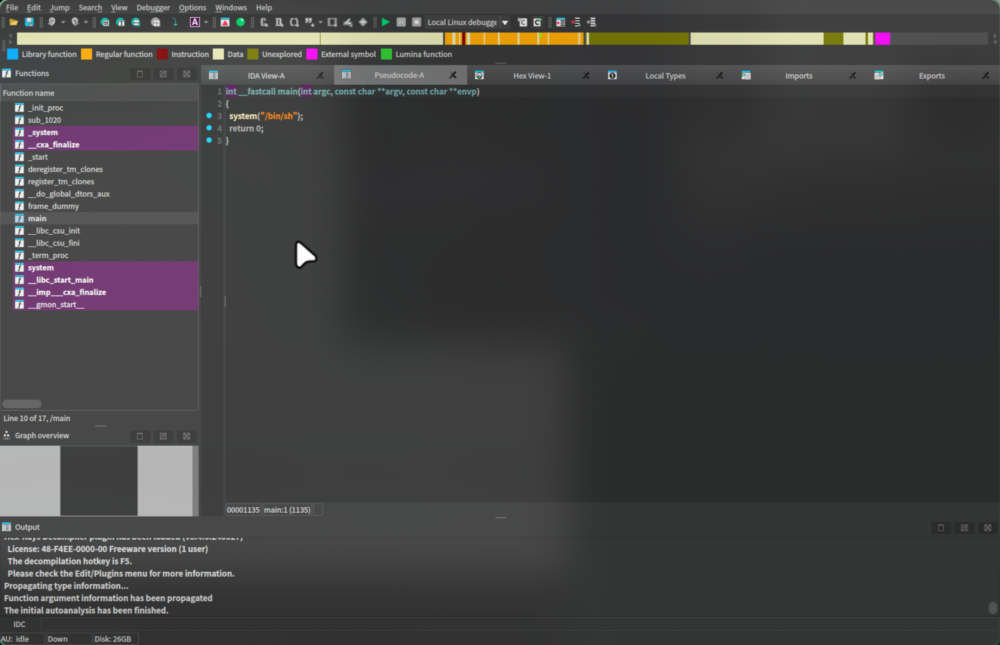

<center>Pwn系列</center>


[toc]


## Pwn系列

> 什么是pwn: 二进制溢出也称之为PWN。
>
> [bilibili](https://www.bilibili.com/video/BV1X4ByY2EKv/)


### 1. 靶场

> buctf: [ctf](https://buuoj.cn/challenges)


### 2. 分析

> Exeinfo PE: 查壳工具。[github](https://github.com/ExeinfoASL/ASL/releases/tag/exeinfo)
>
> 跨平台的： [Detect-it-Easy](https://github.com/horsicq/Detect-It-Easy)

```shell
yay -S detect-it-easy
```


### 3. ida分析

> ida

```shell
yay -S ida-free
```

汇编代码


> `tab`伪代码



> 知道代码后，我们连接主机

```shell
# 连接靶场
nc node5.buuoj.cn 26813 

# 查看flag
cat flag
```


