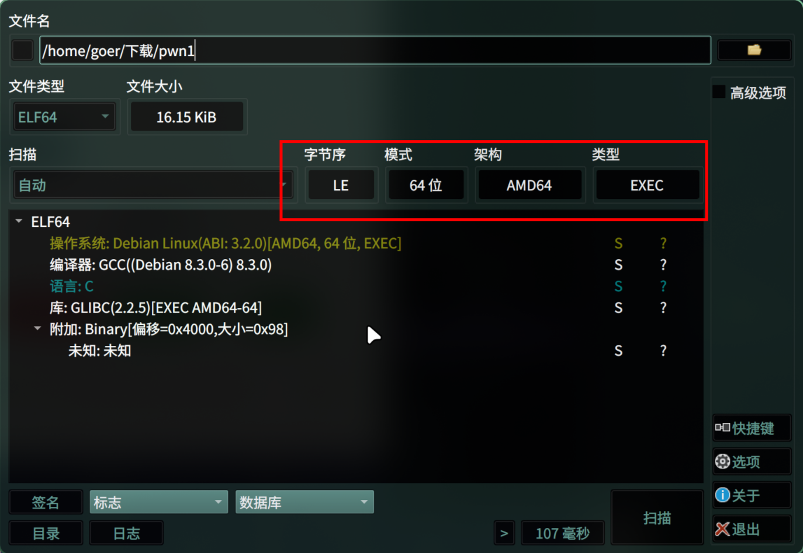

<center>Gets溢出漏洞</center>


[toc]


## Gets溢出漏洞

> Gets函数


### 1. gets栈溢出

> gets() 函数是一个不安全的输入函数，因为它没有长度限制，可能导致缓冲区溢出。

````c
#include <stdio.h>

void vulnerable_function() {
    char buffer[10];
    gets(buffer);  // 危险！可能导致缓冲区溢出
}

int main() {
    vulnerable_function();
    return 0;
}

### 4. 使用 scanf 的替代方案

```c
#include <stdio.h>

int main() {
    char str[50];
    printf("请输入字符串: ");
    scanf("%49s", str);  // 限制输入长度
    printf("你输入的是: %s\n", str);
    return 0;
}
```
````

> buuctf: pwn [warmup_csaw_2016](https://buuoj.cn/challenges)



```shell
```


