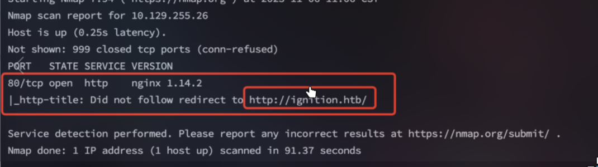

<center>Lgnition</center>


[toc]


## Lgnition

> Lgnition


### 1. task

1. Which service version is found to be running on port 80?

```shell
nginx 1.14.2
```

2. What is the 3-digit HTTP status code returned when you visit http://{machine IP}/?

```shell
302
```

3. What is the virtual host name the webpage expects to be accessed by?

```shell
ignition.htb
```

4. What is the full path to the file on a Linux computer that holds a local list of domain name to IP address pairs?

```shell
/etc/hosts
```

5. Use a tool to brute force directories on the webserver. What is the full URL to the Magento login page?

```shell
http://ignition.htb/admin
```

6. Look up the password requirements for Magento and also try searching for the most common passwords of 2023. Which password provides access to the admin account?

```shell
qwerty123
```


### 2. magento

> Magento 是一个开源的电子商务平台。 [github](https://github.com/magento/magento2)

```shell
强大的电商功能
高度可定制
多商店支持
SEO 友好
丰富的扩展生态
```

````shell
1. 服务器


#### Ubuntu/Debian 安装
```bash
# 更新系统
sudo apt update
sudo apt upgrade

# 安装 LAMP
sudo apt install apache2 mysql-server php php-cli php-fpm php-json php-common \
php-mysql php-zip php-gd php-mbstring php-curl php-xml php-bcmath php-intl \
php-soap

# 或安装 LEMP
sudo apt install nginx mysql-server php php-fpm php-json php-common \
php-mysql php-zip php-gd php-mbstring php-curl php-xml php-bcmath php-intl \
php-soap
```


### 4. 安装 Composer

```bash
# 下载 Composer
php -r "copy('https://getcomposer.org/installer', 'composer-setup.php');"
php composer-setup.php
sudo mv composer.phar /usr/local/bin/composer
```


### 5. 安装 Elasticsearch

```bash
# 安装 Java
sudo apt install default-jre

# 添加 Elasticsearch 源
wget -qO - https://artifacts.elastic.co/GPG-KEY-elasticsearch | sudo apt-key add -
echo "deb https://artifacts.elastic.co/packages/7.x/apt stable main" | sudo tee /etc/apt/sources.list.d/elastic-7.x.list

# 安装 Elasticsearch
sudo apt update
sudo apt install elasticsearch

# 启动服务
sudo systemctl start elasticsearch
sudo systemctl enable elasticsearch
```


### 6. 安装 Magento

```bash
# 创建项目目录
cd /var/www/html
composer create-project --repository-url=https://repo.magento.com/ magento/project-community-edition magento2

# 设置权限
cd magento2
find var generated vendor pub/static pub/media app/etc -type f -exec chmod g+w {} +
find var generated vendor pub/static pub/media app/etc -type d -exec chmod g+ws {} +
chown -R :www-data .
chmod u+x bin/magento
```
````

```shell
docker 搭建。
https://hub.docker.com/r/bitnami/magento
```


### 3. flag

> 获取flag

```shell
nmap -sC -sV IP
```



```shell
# 加入hosts文件
vim /etc/hosts

IP   ignition.htb
```

```shell
# 目录扫描
gobuster dir -u  http://ignition.htb/ -w directory-list-2.3-small.txt 


http://ignition.htb/admin

搜索Magento相关信息可知，默认账户admin，密码为7个及以上字符，但是反暴力破解，尝试手工测试常见密码。测试结果为admin：
admin/qwerty123
```

