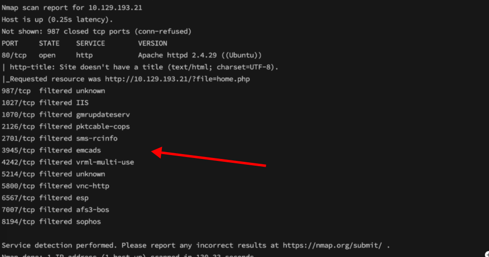
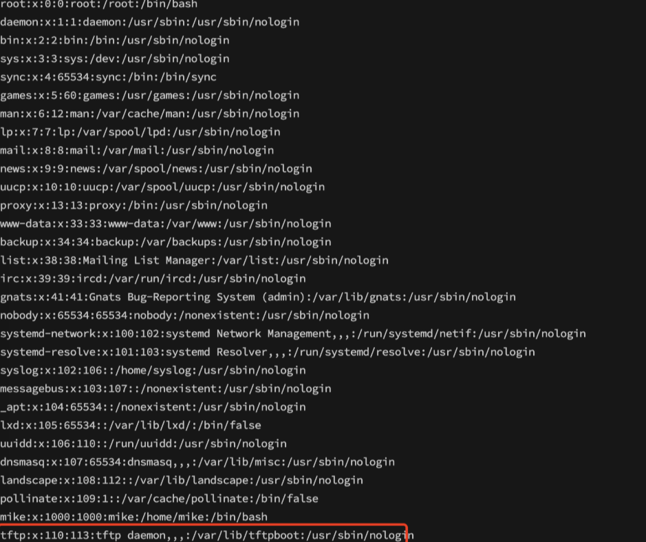

<center>Included</center>


[toc]


## Included

> Included


### 1. task

1. What service is running on the target machine over UDP?

```shell
tftp
```

2. What class of vulnerability is the webpage that is hosted on port 80 vulnerable to?

```shell
Local File Inclusion
```

3. What is the default system folder that TFTP uses to store files?

```shell
/var/lib/tftpboot/
```

4. Which interesting file is located in the web server folder and can be used for Lateral Movement?

```shell
.htpasswd
```

5. What is the group that user Mike is a part of and can be exploited for Privilege Escalation?

```shell
lxd
```

6. When using an image to exploit a system via containers, we look for a very small distribution. Our favorite for this task is named after mountains. What is that distribution name?

```shell
Alpine
```

7. What flag do we set to the container so that it has root privileges on the host system?

```shell
security.privileged=true
```

8. If the root filesystem is mounted at /mnt in the container, where can the root flag be found on the container after the host system is mounted?

```shell
/mnt/root
```


### 3. flag

> 获取flag
>
> [blog](https://blog.csdn.net/sycamorelg/article/details/134369643)

* 信息收集

```shell
nmap -sC -sV ip
```



> 访问web页面

```shell
文件包含漏洞探测
```

> **观察请求地址：http://10.129.193.21/?`file=home.php`，利用file参数动态加载文件，尝试进行文件包含漏洞探测。**
>
> **服务器操作系统是ubuntu，尝试包含`/etc/passwd`文件，成功访问/etc/passwd\****

```shell
culr "ip/?file=/etc/passwd"
```



> TFTP利用： 
>
> 在包含/etc/passwd文件后，发现存在mike、tftp用户。
>
>   TFTP (Trivial File Transfer Protocol)是一种简单的协议，提供基本的文件传输功能，不需要用户身份验证。TFTP使用用户数据报协议(UDP)进行通信，适用于不需要文件传输协议(FTP)提供的复杂交互的应用程序。
>   通过上述描述可知：TFTP运行在UDP端口上，并且不需要身份验证。

>  **TFTP服务器已经连接上，可以上传下载文件，此时可以通过TFTP服务器上传一个反弹shell，使用文件包含漏洞执行shell。**

```shell
# 使用TFTP连接工具
tfpt ip

# 上传shell
put  reverse-shell.php
```

