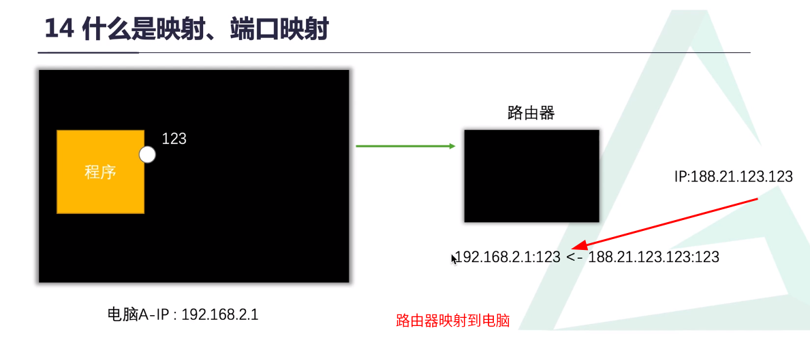
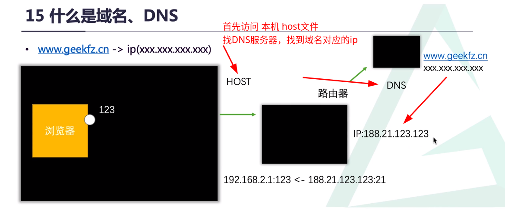
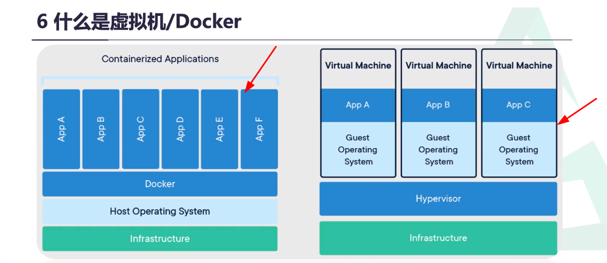
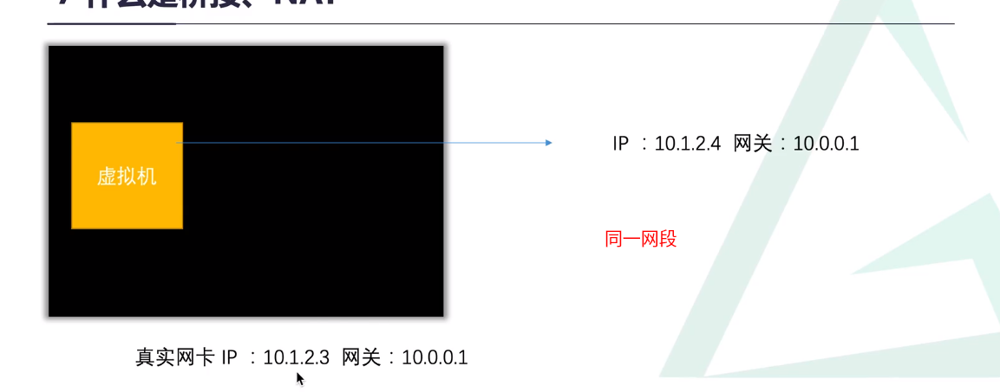
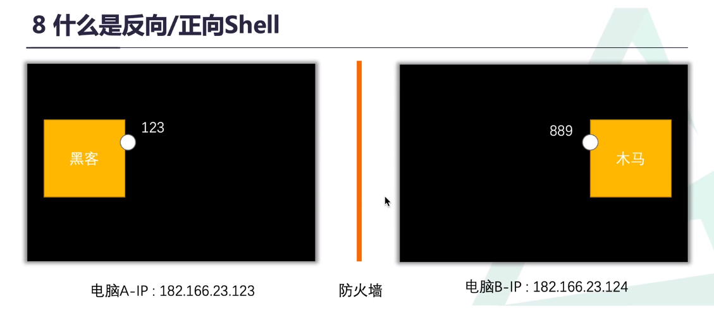

<center>理论知识</center>

[toc]

****

## 走进安全

> 一切都是**理论为龙头**，了解理论知识才可*举一反三*


### 1. DeeLMind(舟长)

> deelmind(Deep Learn & Mind 深思学习)
>
> > 核心：`懂进攻-知防守——先正向-后逆向`

**逆水思寒，顺风知暖**


==极客方舟==：十年磨一剑，一心磨十年

> 虽然我们生于浮华，但我们不能死于浮华，愿极客方舟能如同五浊乱世的一叶方舟，给大家带来前进的希望，我们且而且珍惜。

*方法：认真学习理论，了解其原理，注重思考*


### 2.基础知识篇

##### 1. WEB

> web(World Wide Web)万维网 : 超文本的HTTP传输的分布式图形信息系统.

* 前端：你看到的网页  ->  HTML、CSS、Javascript
* 后端:  你不能直接看到的 -> PHP、Python..

> 语言只是工具：看你自己的==需求==，(和如果中国人交流当然要说汉语，和日本人交流当然要学日语)

* 数据库：存放数据的容器 -> Mysql、Oracle、MongoDB

> 那个数据库好:也是看自己的需求,大型的Oracle呀

* 协议

> **规定好的通信**,交流方式  (第一步要做什么,步骤这些)


##### 2. Web安全

> 前端  后端   协议 数据库 等等都出现问题

* 服务器 :  就是一台性能好的**电脑**

* ip地址:(Internet Protocol Address) 是指互联网协议地址,**全球唯一**

* 端口:(port ==0~65535==)每个软件的一个**通信进出口**

  

### 3. 网的分类

- 局域网:LAN(Local Area Network)  *内网*

```tex
1. 192.168.*.*
2. 172.16.*.* ~ 172.31.*.*
3. 10.*.*.*
```

* 广域网:WAN(Metropolitan Area Network) 其他ip地址,可以直接访问  *外网*

* URL(Uniform Resource Location):统一资源定位符（资源的位置）**唯一性**   每个资源的位置
* Mac地址: （Media Access Control）介质访问控制符,**全球唯一**,任何设备都带有.


#### 4. 映射和端口映射

> 只有网络通信就要打开**端口**




> 路由器上没有端口可以将它映射到本机， *木马回连，反弹shell*


#### 5. 域名和DNS

> 域名就是ip地址别名， 让它个好记忆
>
> NDS:服务器，地址解析协议，提供域名解析服务




> 本机host文件，最先查看有无对应的ip/域名，没有则回访问dns服务器，查询服务器域名对应ip。


#### 6.网卡和网关 *

> 网卡：联网设备（芯片，pcd板电路印刷板，天线）
>
> 网关： 网络关口，(海关)进出都会检查   

```

ipconfig/ifconfig   网卡信息

tracert 域名/ip      路由跟踪
```


> ipv4 ：2^32-1个地址
>
> ipv6 :   2^128-1个地址  解决ipv4地址不足，地址空间更大，具有更高的安全性


#### 7.Linux/Windows 

> 操作系统：os(Operating System) 管理硬件和软件的  **软件**

> linux : 多命令行  服务器
>
> windwos :  多图形化界面  普通用户  用户数最多


#### 8.虚拟机和Docker

> 虚拟机：vmware/virtualbox  虚拟出另一个操作系统  
>
> Docker: 容器，小巧灵活特别好用




#### 9.桥接和NAT *

> 桥接：同一网段，主机和虚拟机经过同一网关   （同一级关系）
>
> Nat :    不同网段  虚拟网卡         （父子关系）




#### 10.Shell 和webshell

> shell :控制计算机的命令行界面
>
> webshell: 通过网页形式控制计算机的命令行网页界面


> 正向shell :黑客连接主机
>
> 反向shell :受害者连接黑客




#### 11.密码相关

> 弱口令：很简单的密码 123456 
>
> 字典： 一系列的密码集合
>
> 暴力破解： 一个一个密码的尝试


#### 12. Cookie/Session *

> 都是**保存状态的文件或数据**   比如第二次登录网站就不用输入密码和用户名
>
> Cookie:存放在客户端
>
> Session:放在服务端


> Bypass:  绕过  发现安全狗/防范软件的问题绕过它攻击   （绕过保安，翻墙进去）


#### 13.攻击，漏洞

> 0day漏洞：发现最新的漏动
>
> 攻击：获取目标价值，获取目标shell
>
> DDOS: 拒绝服务攻击，无数主机同时访问服务器
>
> 肉鸡：已经攻击占领的计算机


> 代码审计：审计工具帮助安全人员找bug、漏洞


#### 14 CTF/AWD

> ctf(Capture The Flag)：夺旗赛，黑客殿堂    线上比赛
>
> awd(Attack With Defence)：线下比赛


> 靶机：搭建好的漏动测试环境的计算机
>
> DVWA: 一个漏动环境
>
> CMS：内容管理系统，**后台**


#### 15 渗透

> 攻击工具：不能太只注重工具的使用  **明白原理**
>
> 后渗透： 建立持久访问