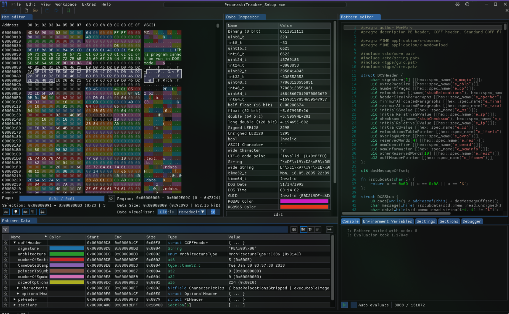

<center>ImHex十六进制编辑器</center>


[toc]


## ImHex十六进制编辑器

> 专为逆向工程师、程序员和凌晨 3 点工作时重视视网膜的人们提供的十六进制编辑器 [github](https://github.com/WerWolv/ImHex)





### 1. 安装

> [releases ](https://github.com/WerWolv/ImHex/releases)[install](https://github.com/WerWolv/ImHex/blob/master/INSTALL.md)

```shell
# arch
 yay -S imhex
```

