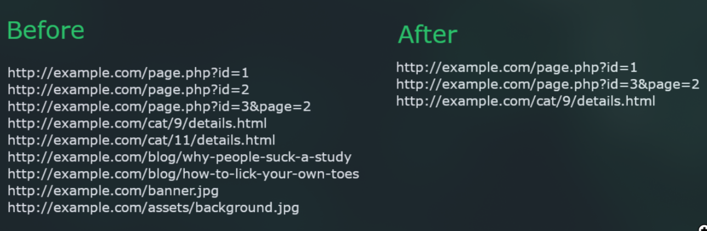

<center>Uro过滤</center>


[toc]


## Uro过滤

> 清理 URL 列表，方便抓取/渗透测试





### 2. 安装

```shell
sudo apt install pipx -y
# uro url提取
pipx install uro
```


### 2. 使用


#### 从文件读取 URL (-i/--input)


```
uro -i input.txt
```

#### 将 URL 写入文件 (-o/--output)


如果文件已经存在，uro 将不会覆盖其内容。否则，它将创建一个新文件。

```
uro -i input.txt -o output.txt
```

#### 白名单 ( `-w/--whitelist`)


uro 将忽略除提供的扩展之外的所有其他扩展。

```
uro -w php asp html
```

**注意：**无扩展名的页面`/books/1`仍将包含在内。要删除它们，请使用 `--filter hasext`。

#### 黑名单（`-b/--blacklist`）


uro 将忽略给定的扩展。

```
uro -b jpg png js pdf
```

**注意：** uro 有一个“无用”扩展名列表，默认情况下会将其删除；该列表将被您通过黑名单选项提供的任何扩展名覆盖。无扩展名的页面（例如 /books/1）仍将包含在内。要删除它们，请使用`--filter hasext`。

#### 过滤器（-f/--filters）


对于粒度控制，uro 支持以下过滤器：

1. **hasparams：**仅输出具有查询参数的 URL，例如`http://example.com/page.php?id=`
2. **noparams：**仅输出没有查询参数的 URL，例如`http://example.com/page.php`
3. **hasext:**仅输出带有扩展名的 URL，例如`http://example.com/page.php`
4. **noext：**仅输出没有扩展名的 URL，例如`http://example.com/page`
5. **keepcontent：**保留人类撰写的内容，例如博客。
6. **keepslash:**不要从 URL 中删除尾部的斜杠，例如`http://example.com/page/`
7. **vuln：**仅输出已知存在漏洞的参数的 URL。[更多信息。](https://github.com/s0md3v/parth)

例子：`uro --filters hasexts hasparams`

